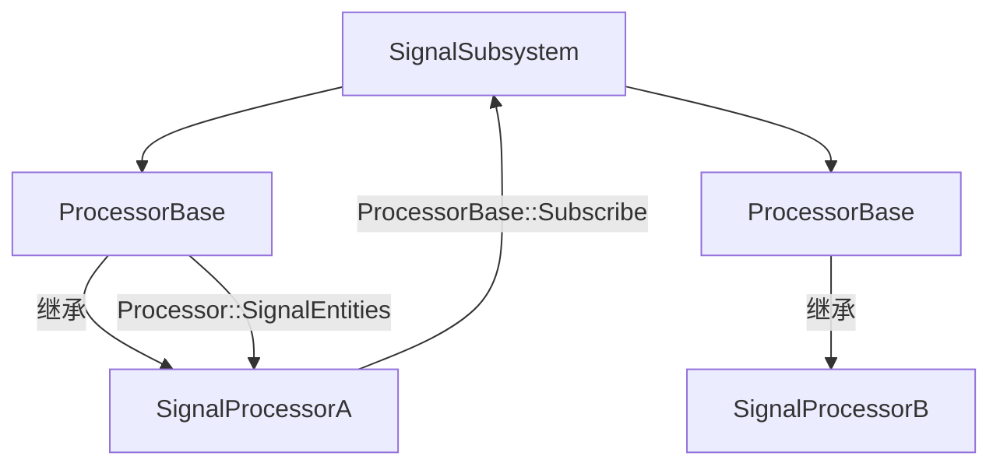

OverCrowd插件学习：[How to Create MASSIVE Crowds and Battle Scenes in Unreal Engine 5 - Niagara and OverCrowd](https://www.youtube.com/watch?v=1BcKEd9UO9k)

MassAI示例：[MassAIExample](https://github.com/Ji-Rath/MassAIExample#open-simulation-example)

BAT插件：[MaaassParticle](https://github.com/DevDingDangDong/MaaassParticle)

MassEntity学习：[[UOD2022]不Mass怎么Meta | Epic 大钊](https://www.bilibili.com/video/BV13D4y1v7xx/?spm_id_from=333.337.search-card.all.click&vd_source=7e66f11d9fdbda24189a1ee2ad49f9ab)
[[技术演讲]在UE5中用Mass框架构建海量实体(官方字幕)](https://www.bilibili.com/video/BV1nB4y1y7cX/?spm_id_from=333.337.search-card.all.click&vd_source=7e66f11d9fdbda24189a1ee2ad49f9ab)
[智能对象概述](https://dev.epicgames.com/documentation/zh-cn/unreal-engine/smart-objects-in-unreal-engine---overview?application_version=5.6)
[UE5的ECS：MASS框架(一)](https://zhuanlan.zhihu.com/p/441773595)
[MassAI初探](https://zhuanlan.zhihu.com/p/530634528)

没看的：[人群配置到行走 Crowd config【Mass AI 篇章】 UE5.1](https://www.bilibili.com/video/BV1gieJeDE2L/?vd_source=7e66f11d9fdbda24189a1ee2ad49f9ab&spm_id_from=333.788.videopod.sections)

# 粒子系统

市面上大部分的人群解决方案是粒子系统加VAT实现的，优点是性能较高，缺点是难以控制某个Entity，难以实现交互。在OverCrowd中可以模拟大规模Entity移动，但是没有动画的LOD与较好的混合，现在的动画混合是读取两个动画数据后进行类似Lerp的操作，所以中近距离观看时动画瑕疵特别大，另外，OverCrowd插件在摄像机距离过远时会对Entity进行裁剪（Entity会掉到地面下），镜头拉近后也无法复原。

## 粒子系统中对MeshLOD

在MassAIExample中的粒子模拟5万个人的示例中的粒子系统


这三个LOD通过VisibilityTag实现区分。默认情况下该值为0，而渲染器中Renderer Visibility也默认为0，则通常情况下这两者相等，即意味着它可见。但是当我们修改VisibilityTag时，则需要去找对应Renderer Visibility也为对应修改值的渲染器进行渲染，而原先这个Renderer Visibility = 0的渲染器就不可见了。


如下图，我们可以看到根据摄像机距离进行更改每个粒子的VisibilityTag加上上面的RendererVisibility设置，就可以实现LOD的效果

## NeighborGrid3D

> 参考：[【中文字幕】从新手到高手：Niagara's NeighborGrid3D](https://www.bilibili.com/video/BV1KoNnzYEkt/?spm_id_from=333.1391.0.0&vd_source=7e66f11d9fdbda24189a1ee2ad49f9ab)
>
> [Niagara's NeighborGrid3D原视频连接](https://www.youtube.com/watch?v=82asza6Kv24)
>
> [Niagara Neighbor Grid 3D 相关节点的解读 和原理](https://zhuanlan.zhihu.com/p/395801716)
>
> [UE4：Niagara的变量与HLSL](https://zhuanlan.zhihu.com/p/342315125)

使用PBD进行粒子间的避障，一般不会直接设置位置，因为这样有可能使某些粒子速度过大，可以考虑的是将偏移方向与大小暴露出来交给`Linear Force`和`Sprite Based Line`进行计算（OverCrowd就是这么做的）

### Attribut Reader

他读属性的节点的注释说：读取的是上一帧的数据。那我们在脚本一直用的上一帧数据处理这一帧碰撞岂不是乱套了。不过，并非如此。首先这个提示并没有错，但是在`Simulation Stage`中我们这样做是没有问题的，而在`Particle Update Stage`中就像注释说的那样使用的是previous数据，更准确的说是当前帧的Update Stage开始前的初始数据。每个Simulation Stage的迭代都相当于独立的更新堆栈，这意味着当开始执行Simulation Stage的迭代时，Attribut Reader获取的数据实际上是更新堆栈结束时的数据

### Point Based Dynamics（位置动力学PBD）

粒子所有的计算都基于位置数据。核心思想是在预测位置（QueryGrid）设置约束条件，比如寻找不发生穿模的有效位置，并仅根据位置变化量和时间步长推到速度，这个速度是为了让Niagara在下一帧应用`Solve Forces and Velocity`

# MassAI

在UE示例工程CitySample中使用的是MassEntity与VAT结合的方式，此方式优点在于每一个Entity行为可控可交互，缺点是如果在MassEntity配置中使用`StateTree`可能会导致CPU线程较高。

## CitySample自动切换VAT处理后的Entity动画

1、创建并配置AnimToTextureDataAsset，右键RunAnimToTexture，会运行`Engine\Plugins\Experimental\AnimToTexture\Source\AnimToTextureEditor\Private\AnimToTextureAssetActions.cpp`的`FAnimToTextureAssetActions::RunAnimToTexture`函数，其中调用：

```c++
// Create UVs and Textures
if (UAnimToTextureBPLibrary::AnimationToTexture(DataAsset))
```

2、在AnimationToTexture函数中：除了将数据拷贝到贴图中外也对DataAsset中的一些数据进行处理，比如下面将每段动画的起止时间记录下来方便接下来的动画转换

```c++
//Bakes Animation Data into Textures.
bool UAnimToTextureBPLibrary::AnimationToTexture(UAnimToTextureDataAsset* DataAsset)
{
    if (!DataAsset)
    {
       return false;
    }

    // Runs some checks for the assets in DataAsset
    int32 SocketIndex = INDEX_NONE;
    TArray<FAnimToTextureAnimSequenceInfo> AnimSequences;
    if (!CheckDataAsset(DataAsset, SocketIndex, AnimSequences))
    {
       return false;
    }
    //...
    // Get Animation Frames Data
	for (int32 AnimSequenceIndex = 0; AnimSequenceIndex < AnimSequences.Num(); AnimSequenceIndex++)
	{
        //...
        // Store Anim Info Data
		FAnimToTextureAnimInfo AnimInfo;
		AnimInfo.StartFrame = DataAsset->NumFrames;
		AnimInfo.EndFrame = DataAsset->NumFrames + AnimNumFrames - 1;
		DataAsset->Animations.Add(AnimInfo);
        //...
    }
    //...
}
```

3、在`UEProjects\CitySample\Plugins\CitySampleMassCrowd\Source\CitySampleMassCrowd\Private\MassCrowdUpdateISMVertexAnimationProcessor.cpp`中的Execute函数不断更新ISM的顶点动画

```c++
void UMassCrowdUpdateISMVertexAnimationProcessor::Execute(FMassEntityManager& EntityManager, FMassExecutionContext& Context)
{
    EntityQuery.ForEachEntityChunk(EntityManager, Context, [](FMassExecutionContext& Context)
    {
       //...
       const int32 NumEntities = Context.GetNumEntities();
       for (int32 EntityIdx = 0; EntityIdx < NumEntities; EntityIdx++)
       {
          if (Representation.CurrentRepresentation == EMassRepresentationType::StaticMeshInstance)
          {
             UpdateISMVertexAnimation(ISMInfo[Representation.StaticMeshDescHandle.ToIndex()], AnimationData, RepresentationLOD.LODSignificance, Representation.PrevLODSignificance);
          }
       }
    });
}
void UMassCrowdUpdateISMVertexAnimationProcessor::UpdateISMVertexAnimation(FMassInstancedStaticMeshInfo& ISMInfo, FCrowdAnimationFragment& AnimationData, const float LODSignificance, const float PrevLODSignificance, const int32 NumFloatsToPad /*= 0*/)
{
	FMassTrafficInstancePlaybackData InstanceData;
	UMassTrafficInstancePlaybackLibrary::AnimStateFromDataAsset(AnimationData.AnimToTextureData.Get(), AnimationData.AnimationStateIndex, InstanceData.CurrentState);
	InstanceData.CurrentState.GlobalStartTime = AnimationData.GlobalStartTime;
	InstanceData.CurrentState.PlayRate = AnimationData.PlayRate;
	ISMInfo.AddBatchedCustomData<FMassTrafficInstancePlaybackData>(InstanceData, LODSignificance, PrevLODSignificance, NumFloatsToPad);
}
```
通过这个函数将之前存到DataAsset中的起止时间根据`AnimationStateIndex`读取出来

```c++
bool UMassTrafficInstancePlaybackLibrary::AnimStateFromDataAsset(const UAnimToTextureDataAsset* DataAsset, int32 StateIndex, FMassTrafficAnimState& AnimState)
{
    if (DataAsset && DataAsset->Animations.IsValidIndex(StateIndex))
    {
       const FAnimToTextureAnimInfo& AnimInfo = DataAsset->Animations[StateIndex];
       AnimState.StartFrame = AnimInfo.StartFrame; // AnimInfo.AnimStart;
       AnimState.NumFrames = AnimInfo.EndFrame - AnimInfo.StartFrame + 1; // AnimInfo.NumFrames;
       AnimState.bLooping = true; // AnimInfo.bLooping;

       return true;
    }

    AnimState = FMassTrafficAnimState();
    return false;
}
```

调用`AddBatchedCustomData`函数将数据发送给`FMassISMCSharedData`

```c++
// Adds the specified struct reinterpreted as custom floats to our custom data. Individual members of the specified struct should always fit into a float.
// When adding any custom data, the custom data must be added for every instance.
template<typename InCustomDataType>
void AddBatchedCustomData(InCustomDataType InCustomData, const TArray<FISMCSharedDataKey>& ExcludeStaticMeshRefs, int32 NumFloatsToPad = 0)
{
    //...
    for (int i = 0; i < StaticMeshRefs.Num(); i++)
    {
       if (ExcludeStaticMeshRefs.Contains(StaticMeshRefs[i]))
       {
          continue;
       }

       FMassISMCSharedData& SharedData = (*ISMCSharedDataPtr).GetAndMarkDirtyChecked(StaticMeshRefs[i]);
       const int32 StartIndex = SharedData.StaticMeshInstanceCustomFloats.AddDefaulted(StructSizeInFloats + NumFloatsToPad);
       InCustomDataType* CustomData = reinterpret_cast<InCustomDataType*>(&SharedData.StaticMeshInstanceCustomFloats[StartIndex]);
       *CustomData = InCustomData;
    }
}
```

4、更新`AnimationStateIndex`，前面讲了准备数据和根据`AnimationStateIndex`更新动画数据给ISM，那么`AnimationStateIndex`在哪更新呢，我们可以找到`F:\UEProjects\CitySample\Plugins\CitySampleMassCrowd\Source\CitySampleMassCrowd\Private\MassCrowdAnimationProcessor.cpp`中的`UpdateVertexAnimationState`函数，现在此函数只能根据状态树某些task节点指定的蒙太奇动画序列或根据速度直接指定`AnimationStateIndex`

# MassSignalSubsystem

`\UE_5.6\Engine\Plugins\Runtime\MassGameplay\Source\MassSignals\Private\MassSignalProcessorBase.cpp`这里是Signal真正处理信号的地方，我们现在先分析一下这个然后再讲`MassSignalSubsystem`会清楚许多

## UMassSignalProcessorBase

### 1、双缓冲机制

消费者——取出当前缓冲区数据，并将缓冲区索引后移。

```c++
void UMassSignalProcessorBase::Execute(FMassEntityManager& EntityManager, FMassExecutionContext& Context)
{
    QUICK_SCOPE_CYCLE_COUNTER(SignalEntities);

    const int32 ProcessingFrameBufferIndex = CurrentFrameBufferIndex;
    {
        // 我们只需要锁定当前缓冲区索引更改的部分。
        // 一旦完成更改，传入的信号将进入另一个缓冲区
        UE::TRWScopeLock Lock(ReceivedSignalLock, SLT_Write);
        CurrentFrameBufferIndex = (CurrentFrameBufferIndex + 1) % BuffersCount;
    }
    
    FFrameReceivedSignals& ProcessingFrameBuffer = FrameReceivedSignals[ProcessingFrameBufferIndex];
    TArray<FEntitySignalRange>& ReceivedSignalRanges = ProcessingFrameBuffer.ReceivedSignalRanges;
    TArray<FMassEntityHandle>& SignaledEntities = ProcessingFrameBuffer.SignaledEntities;
    // ...
}
```

生产者——传入信号进入缓冲区

```c++
void UMassSignalProcessorBase::OnSignalReceived(FName SignalName, TConstArrayView<FMassEntityHandle> Entities)
{
	FEntitySignalRange Range;
	Range.SignalName = SignalName;

	UE::TRWScopeLock Lock(ReceivedSignalLock, SLT_Write);

	FFrameReceivedSignals& CurrentFrameBuffer = FrameReceivedSignals[CurrentFrameBufferIndex];

	Range.Begin = CurrentFrameBuffer.SignaledEntities.Num();
	CurrentFrameBuffer.SignaledEntities.Append(Entities.GetData(), Entities.Num());
	Range.End = CurrentFrameBuffer.SignaledEntities.Num();
    //传入缓冲区
	CurrentFrameBuffer.ReceivedSignalRanges.Add(MoveTemp(Range));
}
```

### 2、信号收集与处理

```c++
void UMassSignalProcessorBase::Execute(FMassEntityManager& EntityManager, FMassExecutionContext& Context)
{
    //...
    SignalNameLookup.Reset();
    // 将信号按Entity的原型(Archetype)进行分组 放入EntitySets中
    for (FEntitySignalRange& Range : ReceivedSignalRanges)
    {
        // 为每个信号名称分配位标志，提高处理效率
        const uint64 SignalFlag = SignalNameLookup.GetOrAddSignalName(Range.SignalName);

        // 获取Entity
        TArrayView<FMassEntityHandle> Entities(&SignaledEntities[Range.Begin], Range.End - Range.Begin);
        //加快命中
        FEntitySet* PrevSet = &EntitySets[0];
        for (const FMassEntityHandle Entity : Entities)
        {
            FMassArchetypeHandle Archetype = EntityManager.GetArchetypeForEntity(Entity);
            FEntitySet* Set = PrevSet->Archetype == Archetype ? PrevSet : EntitySets.FindByPredicate([&Archetype](const FEntitySet& Set) { return Archetype == Set.Archetype; });
            if (Set != nullptr)
            {
                // We don't care about duplicates here, the FMassArchetypeEntityCollection creation below will handle it
                Set->Entities.Add(Entity);
                SignalNameLookup.AddSignalToEntity(Entity, SignalFlag);
                PrevSet = Set;
            }
        }
    }
    //...
    // 按原型处理Entity，并将信号发送
    for (FEntitySet& Set : EntitySets)
    {
        if (Set.Entities.Num() > 0)
        {
            Context.SetEntityCollection(FMassArchetypeEntityCollection(Set.Archetype, Set.Entities, FMassArchetypeEntityCollection::FoldDuplicates));
            SignalEntities(EntityManager, Context, SignalNameLookup);//虚函数，调用子类重写后的SignalEntities
            Context.ClearEntityCollection();
        }
        Set.Reset();
    }
    //...
}
```

## SignalProcessor

是`UMassSignalProcessorBase`子类，也是用户真正用到的类，我们拿`UMassStateTreeProcessor`进行讲解。

最重要的是两个虚函数：`InitializeInternal`和`SignalEntities`。

`SignalEntities`函数只做了两件事：Tick这个StateTree实例，找到还没有被Tick的Entity放入`EntitiesToSignal`数组中然后使用`SignalSubsystem.SignalEntities( UE::Mass::Signals::NewStateTreeTaskRequired, EntitiesToSignal );`将在下一帧进行再次Tick尝试。而这里使用的函数作用就是将这些Entity放入生产者函数中。

在初始化中调用了父类的`SubscribeToSignal`函数并传入一个参数——SignalName。这个函数绑定了刚才说的**生产者**函数，他将SignalName放入SignalSubsystem中的一个`TMap<FName, UE::MassSignal::FSignalDelegate> NamedSignals`中用于将SignalName和生产者函数绑定

```c++
void UMassSignalProcessorBase::SubscribeToSignal(UMassSignalSubsystem& SignalSubsystem, const FName SignalName)
{
    check(!RegisteredSignals.Contains(SignalName));
    RegisteredSignals.Add(SignalName);
    //GetSignalDelegateByName  return NamedSignals.FindOrAdd(SignalName);
    SignalSubsystem.GetSignalDelegateByName(SignalName).AddUObject(this, &UMassSignalProcessorBase::OnSignalReceived);
}
```

## UMassSignalSubsystem

### GetSignalDelegateByName

用于查找或添加通过信号名称获得的委托，这个委托就是刚才说的`OnSignalReceived`

```c++
UE::MassSignal::FSignalDelegate& GetSignalDelegateByName(FName SignalName)
{
    return NamedSignals.FindOrAdd(SignalName);
}
```

### SignalEntities

```c++
void UMassSignalSubsystem::SignalEntities(FName SignalName, TConstArrayView<FMassEntityHandle> Entities)
{
    const UE::MassSignal::FSignalDelegate& SignalDelegate = GetSignalDelegateByName(SignalName);
    SignalDelegate.Broadcast(SignalName, Entities);
}
```

很明显就是多播委托，将传入的Entities和信号名称放入上面说的缓冲区中

### DelaySignalEntities

```c++
void UMassSignalSubsystem::DelaySignalEntities(FName SignalName, TConstArrayView<FMassEntityHandle> Entities, const float DelayInSeconds)
{
    // If you hit this ensure
    // - With another thread trying to delay signal then you can use DelaySignalEntityDeferred/DelaySignalEntitiesDeferred
    //   if you have access to a FMassExecutionContext.
    // - With the game thread executing UMassSignalSubsystem::Tick then you need to reorganize your tasks to prevent senders from executing
    //   at the same time as the subsystem tick.
    UE_MT_SCOPED_WRITE_ACCESS(DelayedSignalsAccessDetector);

    FDelayedSignal& DelayedSignal = DelayedSignals.Emplace_GetRef();
    DelayedSignal.SignalName = SignalName;
    DelayedSignal.Entities = Entities;

    DelayedSignal.TargetTimestamp = CachedWorld->GetTimeSeconds() + DelayInSeconds;
}
```

```c++
void UMassSignalSubsystem::Tick(float DeltaTime)
{
    CA_ASSUME(CachedWorld);
    const double CurrentTime = CachedWorld->GetTimeSeconds();

    UE_MT_SCOPED_WRITE_ACCESS(DelayedSignalsAccessDetector);

    for (int i = 0; i < DelayedSignals.Num();)
    {
       FDelayedSignal& DelayedSignal = DelayedSignals[i];
       if (DelayedSignal.TargetTimestamp <= CurrentTime)
       {
          SignalEntities(DelayedSignal.SignalName, MakeArrayView(DelayedSignal.Entities));
          DelayedSignals.RemoveAtSwap(i, EAllowShrinking::No);
       }
       else
       {
          i++;
       }
    }
}
```

这个由于有一个`DelayedSignals`，所以有线程访问权限保护`UE_MT_SCOPED_WRITE_ACCESS(DelayedSignalsAccessDetector);`，不过你可以从注释看出来还有一个Deferred版本的函数用于多线程。

那么综上所述，SignalSubsystem还是比较简单的。



# MassProcessor

Mass Entity Processor是Mass框架中处理实体的核心组件。它通过组合多个用户定义的查询（queries）来计算和处理实体。(也就是说，一个Processor可以包含多个Query)

## 基本特性

1. **自动注册机制**

   - 所有继承自UMassProcessor的类都会自动注册到Mass系统
   - 默认添加到`EMassProcessingPhase::PrePhsysics`处理阶段

2. **处理阶段** 处理器可以配置在不同的处理阶段执行，对应不同的`ETickingGroup`：

   | 处理阶段      | 对应TickingGroup | 说明                   |
   | :------------ | :--------------- | :--------------------- |
   | PrePhysics    | TG_PrePhysics    | 物理模拟开始前执行     |
   | StartPhysics  | TG_StartPhysics  | 开始物理模拟的特殊阶段 |
   | DuringPhysics | TG_DuringPhysics | 与物理模拟并行执行     |
   | EndPhysics    | TG_EndPhysics    | 结束物理模拟的特殊阶段 |
   | PostPhysics   | TG_PostPhysics   | 刚体和布料模拟后执行   |
   | FrameEnd      | TG_LastDemotable | 帧末尾的兜底阶段       |

下面是在处理器的**构造函数**中，一些基本的可以配置的内容：

1. **注册控制**

   ```c++
   bAutoRegisterWithProcessingPhases = true;  // 是否自动注册到处理阶段
   ```

2. **处理阶段设置**

   ```c++
   ProcessingPhase = EMassProcessingPhase::PrePhysics;  // 显式设置处理阶段
   ```

3. **执行顺序控制**

   ```c++
   // 使用内置的移动处理器组
   ExecutionOrder.ExecuteInGroup = UE::Mass::ProcessorGroupNames::Movement;
   // 设置在指定处理器之后执行 //也有Before
   ExecutionOrder.ExecuteAfter.Add(TEXT("MSMovementProcessor"));
   ```

4. **执行环境控制**

   ```c++
   // 设置在哪些环境下执行（客户端/服务器/单机）
   ExecutionFlags = (int32)(EProcessorExecutionFlags::Client | EProcessorExecutionFlags::Standalone);
   ```

5. **线程控制**

   ```c++
   bRequiresGameThreadExecution = true;  // 是否需要在游戏主线程执行
   ```

## ExecutionOrder

**执行顺序控制**

我们可以在`F:\UE_5.6\Engine\Source\Runtime\MassEntity\Private\MassProcessorDependencySolver.cpp`发现函数`FMassProcessorDependencySolver::CreateNodes`虽然这个函数不直接计算最终的执行顺序，但它为后续的拓扑排序提供了必要的依赖信息。系统会根据这些依赖关系进行拓扑排序，得出最终的执行顺序。我先大致讲一下他们的依赖处理数组如何构建，然后给出如何合理的组织Group和Execute顺序。

### 函数作用

这个函数的主要作用是为Mass Processor创建依赖图中的节点，用于后续确定Processor的执行顺序。具体功能包括：

1，首先对Processor所属的Group作为一个Node加入到`AllNodes`中，FNode的Name使用组名。并将此Node在`AllNodes`中的Index记录到`NodeIndexMap`中。保存这个Group的Index，后面有用

```c++
int32 ParentGroupNodeIndex = INDEX_NONE;
//...
int32* LocalGroupIndex = NodeIndexMap.Find(GroupFName);
if (LocalGroupIndex == nullptr)
{
    int32 NewGroupNodeIndex = AllNodes.Num();
    NodeIndexMap.Add(GroupFName, NewGroupNodeIndex);
    FNode& GroupNode = AllNodes.Add_GetRef({ GroupFName, nullptr, NewGroupNodeIndex });
    // just ignore depending on the dummy "root" node
    if (ParentGroupNodeIndex != INDEX_NONE)
    {
        GroupNode.OriginalDependencies.Add(ParentGroupNodeIndex);
        AllNodes[ParentGroupNodeIndex].SubNodeIndices.Add(NewGroupNodeIndex);
    }

    ParentGroupNodeIndex = NewGroupNodeIndex;
}
else
{	
    ParentGroupNodeIndex = *LocalGroupIndex;
}
```

2，放入真正的Processor作为Node到`AllNodes`中，并添加前后依赖关系

```c++
const int32 NodeIndex = AllNodes.Num();
NodeIndexMap.Add(ProcName, NodeIndex);
FNode& ProcessorNode = AllNodes.Add_GetRef({ ProcName, &Processor, NodeIndex });

ProcessorNode.ExecuteAfter.Append(ExecutionOrder.ExecuteAfter);
ProcessorNode.ExecuteBefore.Append(ExecutionOrder.ExecuteBefore);
Processor.ExportRequirements(ProcessorNode.Requirements);
```

3，最后取到所属的Group的Node对他的`SubNodeIndices`数组添加Processor在`AllNodes`中的Index构成图

```c++
if (ParentGroupNodeIndex > 0)
{
    AllNodes[ParentGroupNodeIndex].SubNodeIndices.Add(NodeIndex);
}
```

### 如何合理组织Group和Execute顺序

基于对这个函数的理解，我们可以总结出一些最佳实践：

#### 1. 合理选择执行组

```cpp
// 示例：将路径跟随处理器放在Movement组
ExecutionOrder.ExecuteInGroup = UE::Mass::ProcessorGroupNames::Movement;
```


不同的功能应该放在合适的组中，比如：
- 移动相关：Movement group
- 避障相关：Avoidance group

在使用类似`ExecutionOrder.ExecuteAfter.Add(TEXT("MSMovementProcessor"));`确定某些具体Processor的顺序时，最好都是在同一个Group中

#### 2. 明确依赖关系

```cpp
// 确保在避障之前更新路径
ExecutionOrder.ExecuteBefore.Add(UE::Mass::ProcessorGroupNames::Avoidance);

// 或者确保在移动计算之后执行
ExecutionOrder.ExecuteAfter.Add(UE::Mass::ProcessorGroupNames::Movement);
```


#### 3. 避免循环依赖

在设置ExecuteBefore/ExecuteAfter时要小心，避免形成循环依赖，否则可能会导致系统无法计算出有效的执行顺序。

#### 4. 考虑性能因素

将计算密集型的Processor放在合适的位置，避免阻塞关键路径上的其他Processor。

### 扩展

基础的组有`MassGameplay\Source\MassCommon\Public\MassCommonTypes.h`

```c++
namespace UE::Mass::ProcessorGroupNames
{
    const FName UpdateWorldFromMass = FName(TEXT("UpdateWorldFromMass"));//应该是Mass更新的最后的组
    const FName SyncWorldToMass = FName(TEXT("SyncWorldToMass"));//应该是Mass更新的第一个组
    const FName Behavior = FName(TEXT("Behavior"));//MassAI插件中Behavior在很前面
    const FName Tasks = FName(TEXT("Tasks"));//在Behavior后面
    const FName Avoidance = FName(TEXT("Avoidance"));//在Task后面
    const FName ApplyForces = FName(TEXT("ApplyForces"));//在Avoidance后面
    const FName Movement = FName(TEXT("Movement"));//在ApplyForces后面
}
```

然后你还可以自己加组，比如`MassGameplay\Source\MassLOD\Public\MassLODTypes.h`

```c++
namespace UE::Mass::ProcessorGroupNames
{
    const FName LODCollector = FName(TEXT("LODCollector"));
    const FName LOD = FName(TEXT("LOD"));
}
```

一般来讲这些组你可以随意排序，只要合理即可，但是UE写的插件已经有了一定的顺序，你如果使用就最好按照UE的顺序来。

比如Movement是将前面的计算进行统一提交，如下面代码，而当我们需要添加一个使AI移动到某个位置又想使用避障等逻辑，那么最好将他放在Tasks组中，比如`MassAI\Source\MassZoneGraphNavigation\Private\MassZoneGraphNavigationProcessors.cpp`这个中的`UMassZoneGraphPathFollowProcessor`，他就是让AI沿着用户设置好的Lane路线zou

```c++
UMassOffLODNavigationProcessor::UMassOffLODNavigationProcessor(): EntityQuery_Conditional(*this)
{
    ExecutionFlags = (int32)EProcessorExecutionFlags::AllNetModes;
    ExecutionOrder.ExecuteInGroup = UE::Mass::ProcessorGroupNames::Movement;
}

void UMassOffLODNavigationProcessor::Execute(FMassEntityManager& EntityManager,FMassExecutionContext& Context)
{
    EntityQuery_Conditional.ForEachEntityChunk(Context, [this](FMassExecutionContext& Context)
    {
       const TArrayView<FTransformFragment> LocationList = Context.GetMutableFragmentView<FTransformFragment>();
       const TConstArrayView<FMassMoveTargetFragment> MoveTargetList = Context.GetFragmentView<FMassMoveTargetFragment>();

       for (FMassExecutionContext::FEntityIterator EntityIt = Context.CreateEntityIterator(); EntityIt; ++EntityIt)
       {
          FTransform& CurrentTransform = LocationList[EntityIt].GetMutableTransform();
          const FMassMoveTargetFragment& MoveTarget = MoveTargetList[EntityIt];

          // Snap position to move target directly
          CurrentTransform.SetLocation(MoveTarget.Center);
       }
    });
}
```
