* content
{:toc #markdown-toc}

这是一篇关于UE中网络知识的文章。虚幻引擎提供的网络框架非常的强大，在简化开发者的打造网络功能流程的同时，也增加了使用的负担，但是只要我们去了解和学习，这些负担终究会变为我们站在高处的基石。

<!-- more -->

> 参考：[UE官方文档：联网和多人游戏](https://docs.unrealengine.com/4.26/zh-CN/InteractiveExperiences/Networking/)

# 一、尽早规划多人游戏

和官方文档一样，这个真的很重要，第一步就是要在项目规划时就确定好是否需要有多人游戏功能，因为在这之后构建出来的gameplay框架(可能用词不准)几乎是两种完全不同的，我就亲眼看到过一个经验不充足的开发者，在上架一个单人射击游戏后，想要加入联机功能，他在整理整个项目之后告诉我说做不出来，因为这几乎要把整个项目重新写一遍并添加新的功能。如果你真的不太清楚，那么最好是构建有网络框架的gameplay，这样即便后面不需要联机功能，也可以运行。

# 二、开始多人游戏

有些开发者喜欢先做出一些功能再深入了解，说这样脑子里有自己的印象，比直接看概念好。但是我还是要在简单的开始前说什么是多人游戏。

## 1、什么是网络多人游戏

在单人游戏中，即使你用同一台计算机多个设备输入将游戏分屏进行本地多人游戏，这种游戏不需要联网将信息传输到另一台机器上运行游戏实例，所有交互都在同一台机器上的同一场景中发生。

因此我们要说的多人游戏，是指真正的多人游戏，是网络多人游戏，他的交互发生在多个不同场景：服务器上的场景、玩家1客户端的场景、玩家2客户端的场景，等等。每台不同机器上的各场景均有各自的Actor副本。而服务器是游戏真正运行的地方，但我们要让客户端的场景看似发生了相同事件，比如：玩家1向前走了一步。因此，需要选择性地向各客户端发送信息，比如：有关玩家1移动的信息必须发送到玩家2的设备上，而玩家2也向前走了一步，那么我们也必须将玩家2移动的信息发送给玩家1的设备上。

<span id="TestMuti">那么</span>好，先在UE上看看多人游戏模式吧：[测试多人游戏](https://docs.unrealengine.com/4.26/zh-CN/InteractiveExperiences/Networking/TestMultiplayer/), [测试和调试网络游戏](https://dev.epicgames.com/documentation/zh-cn/unreal-engine/testing-and-debugging-networked-games-in-unreal-engine?application_version=5.3)

## 2、测试多人游戏

 一方面可以先有一个小操作使读者有一个大概的印象，另一方面则是我们开发多人游戏时需要时不时的调试多人功能，如果每次都要先和其他开发者同步代码再联机测试未免有些太过繁琐，那么这里就有几种在本地进行多人游戏调试的方法。

### 1)启动独立服务器

**编辑器偏好设置(Editor Preferences)** > **关卡编辑器(Level Editor)** > **运行(Play)** > **多人游戏选项(Multiplayer Options)** > **启动独立服务器(Launch Independent Server)**设为`true`，**运行网络模式(Play Net Mode)** 选择**独立运行(Play Standalone)**，然后你找到**服务器端口(Server Port)**一般默认是`17777`这个你不需要改，然后找到**客户端玩家数量(Play Number Of Clients)**修改为`2`，你也可以尝试3或者以上的数值。ok配置完毕，这时你随意打开一个蓝图，点击运行按钮或者使用快捷键Alt+P，那么这个时候会弹出两个窗口，注意窗口上方的字你会发现有些不同，没错，一个是`Standalone 1`，一个是`Standalone 2`，这是两个独立运行的客户端，分别在命令行输入

```
open 127.0.0.1:17777
```

这时两个客户端就相见了，你可以跳一跳玩一玩。

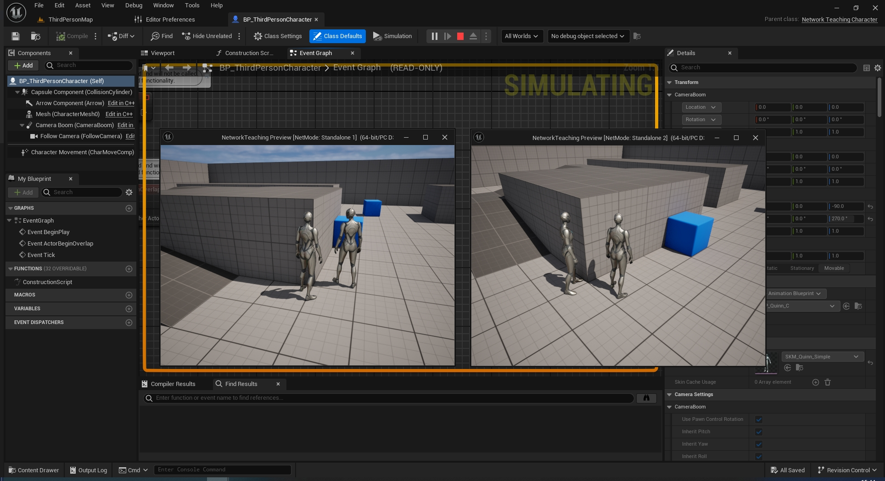

### 2)Play As Listen Server

现在我们将上述的启动独立服务器(Launch Independent Server)设为`false`，随意打开一个蓝图点击运行按钮旁边的三个点或下拉箭头，将下面的`Net Mode`设为`Play As Listen Server`，客户端数量还是2，现在点击运行。此时出现的两个客户端一个作为服务器`Server 0`，另一个则是客户端`Client 1`，哎，那么你就会问了，这个怎么是从0开始的，刚才那个怎么是从1开始的，因为上面那个还有一个你看不见的独立服务器在运行。

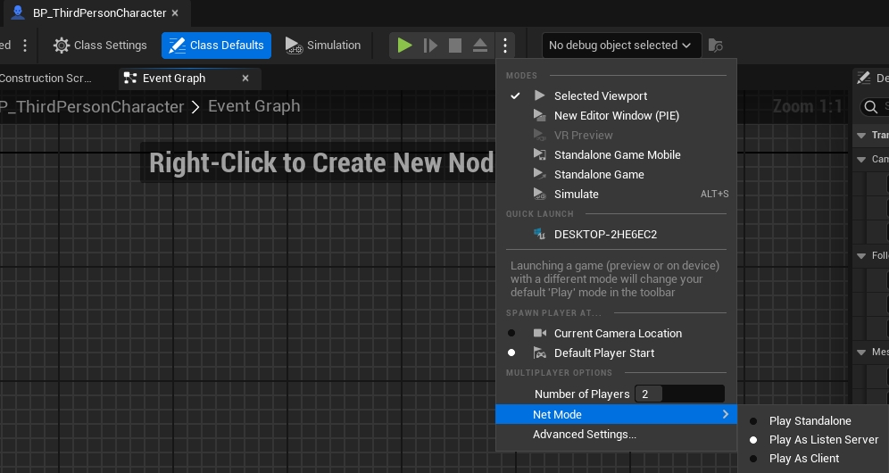

### 3)Play as Client

将Net Mode设为Play as Client运行一下看看，没错有一个隐藏服务器在运行，使用这个方法和第一种是一样的，只不过这个是自动的，按照官方说法，在编辑器的**网络模式选项（Net Mode options）**中使用**作为客户端运行（Play as Client）**或**作为侦听服务器运行（Play As Listen Server）**时，这些实例会自动通过IP地址直接相互连接。这相当于在**客户端**上运行 `open 127.0.0.1:17777` 命令，以便连接到服务器**。所以我们一般使用第2，3种方法测试，不用第一种。

### 4)Standalone Game

这个比较重要，因为在编辑器中运行（PIE）时，[服务器/客户端移动](https://dev.epicgames.com/documentation/zh-cn/unreal-engine/travelling-in-multiplayer-in-unreal-engine?application_version=5.3)等功能存在限制。你的项目需要在独立模式下作为编辑器之外的单独进程运行，以便测试这些功能。

如果你在单独的进程下运行实例，一个实例将被视为在编辑器中运行，而其他实例将被视为独立运行。与统一运行实例相比，不论是统一在编辑器中运行还是统一独立运行，单独运行可能会导致不同的行为。例如，需要调用UEditorEngine::NetworkRemapPath函数，以便在通过网络发送的静态Actor的路径上添加或删除PIE前缀。

所以说如果某些功能在PIE中看不到，但是你感觉没问题那么就试试这个模式，可能就有效果了。

最后再看一下官方给出的[网络模式](https://dev.epicgames.com/documentation/en-us/unreal-engine/networking-overview-for-unreal-engine#networkmodes)图表

| **网络模式**       | `ENetMode`           | **说明**                                                 |
| :----------------------: | -------------------- | -------------------------------------------------- |
| **单机**          | `NM_Standalone`      | 有一个或多个本地玩家且没有联网的游戏。仍被视为服务器，因为它包含所有服务器功能，但不接受来自远程客户端的连接。此模式用于单人和本地多人游戏。此模式可根据需要同时运行服务器端和客户端逻辑。 |
| **专用服务器**     | `NM_DedicatedServer` | 没有本地玩家的服务器。服务器仅接受来自远程客户端的连接，因此为了更高效地运行，服务器放弃了图形、声音、输入和其他面向玩家的功能。此模式常用于需要更持久、安全或大规模多玩家的游戏。 |
| **监听服务器**     | `NM_ListenServer`    | 此服务器也有一个本地玩家，此玩家负责托管游戏。可供网络上的其他玩家链接。此模式常用于临时合作和竞技多人游戏。 |
| **客户端**        | `NM_Client`          | 连接到远程服务器的客户端。客户端连接到网络多人游戏会话中的监听服务器或专用服务器。客户端不运行服务器端逻辑。 |

# 三、网络概述

热身到这里想必你应该有一定的概念了，或许你还有好多疑惑，但是先从理论开始吧。[虚幻引擎网络架构](https://dev.epicgames.com/documentation/en-us/unreal-engine/networking-overview-for-unreal-engine#unrealenginenetworkingarchitecture)

## 1、网络架构

> 参考：[Game server](https://en.wikipedia.org/wiki/Game_server)

这里就开始讲解单独运行的游戏之间在网络中通信获取信息的方法。我们会讲解两种模型：对等模型(PEER-TO-PEER \ P2P)，客户端服务器模型(CLIENT-SERVER model \ C/S model)。

### 1)PEER-TO-PEER

> 参考：[Peer-to-peer](https://en.wikipedia.org/wiki/Peer-to-peer)

这个是传输信息最简单的方法之一，当玩家1移动角色时，该动作信息将直接发送给玩家2的电脑，同样玩家2移动时，也会将信息发送给玩家1，这个听起来就很好实现，但是他有一些问题，现在我们有玩家3加入游戏，每当一个玩家移动时他们都必须将这些信息发送给其他两个玩家，这样会导致有大量的网络数据传输，对于拥有很多玩家的游戏，这听起来很差。

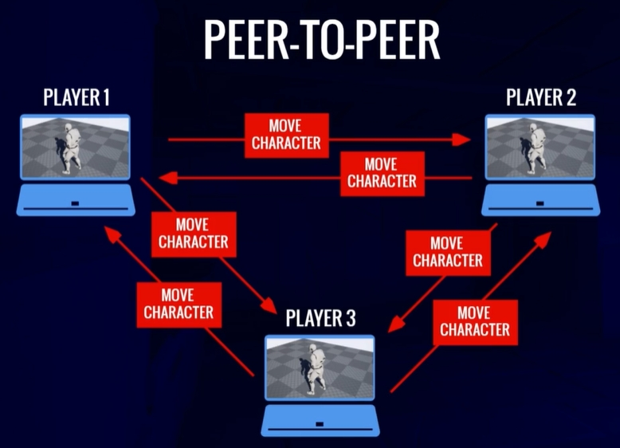

另外这么多人的游戏实例，没有权威的版本，每个都不同，每当玩家改动任一数据，比如走一步，就会偏离本地版本的游戏，其他机器需要一定时间传播接受数据来更新游戏实例，但是谁是真正的正确的游戏实例，没人知道。

### 2)CLIENT-SERVER

> 参考：[Client-server model](https://en.wikipedia.org/wiki/Client%E2%80%93server_model)

制作多人游戏还有一种方法，这种方法也是UE使用的架构，叫做**客户端-服务器架构**，很多玩家使用不同的计算机通过网络连接到一台中央计算机。中央计算机称为**服务器**，它会托管多人游戏，而不同计算机上的其他所有玩家都作为**客户端**连接到该服务器。服务器会将游戏状态信息与每个连接的客户端共享，并为不同计算机上的所有玩家提供了彼此通信的方式。每个客户端都只会与服务器交流，因此每个客户端只需要满足发送和接收自己的信息的宽带要求即可。举个栗子：玩家1移动一步，此信息发送给服务器，服务器发送给其他客户端，这样所有人的屏幕都会更新到玩家1移动了一步。

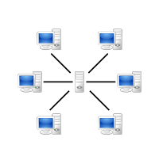
[^1]: *在联网多人游戏中，游戏将在服务器与多个与之连接的客户端之间进行。服务器处理Gameplay，客户端为用户渲染游戏。*

另外UE将服务器作为游戏主机保存一个真正的**权威**游戏状态。即：使用**Authoritative Client-Server Model**，权威客户端服务器架构。(当然实现C/S并不只有这一种方法)。换句话说，服务器是多人游戏实际运行的地方，并且服务器版本是权威版本被视为唯一正确的版本。客户端各自控制它们在服务器上拥有的远程**Pawn**。客户端从其本地Pawn向其服务器Pawn发送*远程程序调用*以在游戏中执行操作。接着，服务器向每个客户端*复制*关于游戏状态的信息，例如**Actor**所在的位置，这些Actor应该具备怎样的行为，以及不同的变量应该有哪些值。然后每个客户端使用这些信息，近似模拟服务器上实际正在发生的情况。所以其实情况是这样的：玩家1按下前进按钮进行移动，实际上将移动请求发送到服务器，然后检测以确保该运动合理，然后服务器移动角色并将移动更新信息再发给所有客户端包括玩家1，从服务器到客户端的数据分发称为**复制**。当然还有一些其他细节，后面再说。

> 默认情况下，服务器不会直接将视觉效果流送到客户端显示器进行显示，服务器会将状态信息发送给客户端游戏实例，以便客户端计算机可以在自己的游戏实例中重现视觉效果。虚幻引擎提供了 **像素流送（Pixel Streaming）** 系统，用于预渲染帧和音频，以在移动端和Web浏览器上显示。更多信息请参阅[像素流送](https://dev.epicgames.com/documentation/zh-cn/unreal-engine/pixel-streaming-in-unreal-engine?application_version=5.3)文档。
>
> 复制详情参阅：[网络概述-复制](https://dev.epicgames.com/documentation/en-us/unreal-engine/networking-overview-for-unreal-engine#replication)

要实现这种权威客户端服务器模型，并不只有一种方法，比如：

- 监听服务器
  也叫Listen-server，这种情况下，有其中一个客户端充当服务器，那么此服务器实际上正在玩游戏并且会将图像渲染到屏幕上，监听服务器的优势在于它基本上是免费的，不需要任何特殊的基础设施或提前规划即可建立，不过由于运行服务器的机器也在生成输出图像，因此性能也会降低。此外，监听服务器为直接在其上玩游戏的玩家提供了比其他作为客户端的玩家更大的延迟优势，并且当该玩家离开游戏时，该服务器将不复存在。由于 Listen-Server 在客户端本身上运行，因此其他人需要连接的 IP 是客户端的 IP。与专用服务器相比，这通常伴随着玩家没有静态IP的问题。但是，使用 OnlineSubsystem（稍后解释）可以解决更改 IP 的问题。

- 专用服务器

  也叫Dedicated-server，这种情况下将某个机器指定为游戏的服务器，没有人在这个机器上玩游戏，无需渲染图像，所以一般这种方法会有两套程序，一个是服务器运行程序，一个是客户端程序。专用服务器的最大优势在于它们适合托管在专业数据中心，并具有所需的所有可靠性和性能优势，同时还消除了低延迟优势，所以一般MMO和竞技游戏会用这种方法。

当你了解这些网络架构后，请想一下我们[之前做的](#TestMuti)，相信你会有更深的理解。

另外在实现的过程中在基础Gameplay交互（碰撞、移动、损伤）、美化效果（视觉效果和声音）以及玩家信息（HUD更新）之间进行了划分。这三者各自与网络中的特定计算机或一组计算机关联。此信息的复制过程并非完全自动化，你必须在Gameplay编程中指定要将哪些信息复制到哪些计算机。主要难点在于选择应该将哪些信息复制到哪些连接，才能为所有玩家提供一致的体验，同时还要最大限度减少信息复制量，避免网络带宽频繁饱和。<span id="NetworkTips">这里有一些优化网络和一些提示: </span>参考[网络概述-联网提示](https://dev.epicgames.com/documentation/en-us/unreal-engine/networking-overview-for-unreal-engine#networkingtips)

#### 联网提示

- 使用尽可能少的RPC和复制的蓝图函数。如果你可以改用Replicated Using（RepNotify）属性，就应该使用它。
- 少用多播函数，因为它们会为每个连接的客户端带来额外的网络流量。
- 如果你可以保证非复制的函数仅在服务器上执行，仅限服务器的逻辑不一定需要包含在服务器RPC中。
- 将可靠RPC绑定到玩家输入时需谨慎操作。玩家可能会迅速反复按键，从而使可靠RPC队列溢出。如果你要这样做，就应该创建一种机制，限制玩家可以根据输入激活RPC的频率。
- 如果RPC被特别频繁地调用，例如在Actor更新函数中，则应将RPC设为不可靠。
- 尽可能经常回收函数。一些函数可以通过调用它们以响应Gameplay逻辑来回收，也可以作为RepNotify来回收，以确保客户端和服务器有并行执行。
- 检查你的Actor的网络角色。若要在同时在服务器和客户端上激活的函数中筛选执行，这会非常有用。
- 使用 `IsLocallyControlled` 检查你的Pawn是否在本地受控制。若要根据Pawn是否对所属客户端相关而筛选执行，这会非常有用。
- 利用网络休眠。这是你可以在网络Gameplay中做出的最显著优化之一。

## 2、Network & Gameplay Framework

### Game Mode

**GameMode**用于定义游戏规则，这包括要生成哪些其他游戏框架类，如 APawn、APlayerController、APlayerState 等。当我们创建GameMode时可以继承自**AGameModeBase**和**AGameMode**。引用源码里的话就是

```c++
/**
 * GameMode is a subclass of GameModeBase that behaves like a multiplayer match-based game.
 * It has default behavior for picking spawn points and match state.
 * If you want a simpler base, inherit from GameModeBase instead.
 */
```

因此大部分虚幻引擎游戏直接继承自AGameModeBase尤其是单机游戏。对于MatchState这个功能，以后会说。另外GameMode仅在服务器上可用。客户端没有AGameModeBase类的实例，并且在尝试检索它时只会得到一个nullptr。

### Game State

GameState同样有**AGameStateBase**和**AGameState**两种类可以继承，和GameMode相似。**AGameState**类可能是服务器和客户端之间共享信息的最重要的类。GameState用于跟踪游戏/比赛的当前状态。对于多人游戏来说，这包括已连接玩家的列表(APlayerState)。此外，它会为所有客户端进行复制，因此每个人都可以访问它。这使得GameState成为多人游戏信息中最核心的类之一。GameMode会告诉我们需要击杀多少次才能获胜，而GameState则会跟踪每个玩家和/或团队当前的击杀次数！在这里存储什么信息完全由您决定。它可以是分数数组，也可以是用于跟踪团体和公会的自定义结构数组。即存储整场游戏的数据。

```c++
/**
 * GameState is a subclass of GameStateBase that behaves like a multiplayer match-based game.
 * It is tied to functionality in GameMode.
 */
```

与GameMode相比，GameState并没有给我们提供太多可供使用的功能，但它仍然允许我们创建我们的逻辑，该逻辑主要应该尝试将信息传播给客户端。

### Player State

**APlayerState**类是共享玩家信息的最重要的类。它用于保存玩家的当前信息。每个玩家都有自己的PlayerState，并且也会复制到每个人，并可用于检索和显示其他客户端上的数据。访问所有PlayerState的简单方法是使用AGameStateBase类中的PlayerArray。

```c++
/** Array of all PlayerStates, maintained on both server and clients (PlayerStates are always relevant) */
UPROPERTY(Transient, BlueprintReadOnly, Category=GameState)
TArray<TObjectPtr<APlayerState>> PlayerArray;
```

PlayerState一般用来存储各自玩家的信息，示例：

- **Player Name** - 玩家的当前名称
- **Score**- 玩家的当前分数
- **Ping** - 玩家当前的 Ping 值
- **Team ID** - 玩家队伍的 ID
- 或者其他玩家可能需要知道的其他复制信息(比如英雄联盟中你出了5个装备，那么在其他玩家的计分板里面也会在你的信息一栏中出现5个装备)

另外PlayerState还用于在无缝切换关卡和断线重连时确保数据的永存性。这个以后再说。

### Pawn

**APawn**类是玩家控制的**“AActor”**。玩家一次只能拥有一个Pawn，但可以通过取消拥有和重新拥有Pawn来轻松地在Pawn之间切换。

**Pawn大部分被复制到所有客户端。**

Pawn的子类**ACharacter**经常被使用，因为它带有一个已经联网的MovementComponent，可以处理复制玩家角色的位置、旋转等。

在多人游戏中，我们主要使用Pawn的复制部分来显示角色并与其他人共享一些信息。一个简单的例子是角色的“血量”。但我们不仅复制“血量”以使其对其他人可见，我们还复制它以便服务器对其拥有权限并且客户端无法作弊。那么你可能会问，这个血量不是玩家各自拥有的变量吗，为什么不放在PlayerState中，因为PlayerState的网络更新较慢，Health变量需要经常处理和进行网络传播放在这里不合适，放在Pawn里做成员变量即可。可以查看[网络同步入门-复制频率](https://www.cnblogs.com/lawliet12/p/17306303.html)

### Player Controller

PlayerController 可以看作是玩家的“Input”。它是玩家与服务器之间的连接。客户端的PlayerController只存在于其终端以及服务器上。客户端无法访问其他客户端的PlayerController。

**每个客户端只知道他们自己的PlayerController！服务器拥有所有客户端PlayerController的引用！**

术语“Input”并不直接意味着所有实际输入（按钮按下、鼠标移动、控制器轴等）都需要放置在玩家控制器中。将特定于 Pawn/Character 的输入 (比如：汽车的工作方式与人类不同) 放入APawn/ACharacter类中，并将适用于所有角色的输入 (甚至当角色对象无效时) 放入PlayerController中，是一种很好的做法。

节点`GetPlayerController(0)`或代码行`UGameplayStatics::GetPlayerController(GetWorld(), 0);`在服务器和客户端上的工作方式不同。

- 在 Listen-Server 上调用它将返回 Listen-Server 的 PlayerController
- 在客户端上调用它将返回客户端的 PlayerController
- 在专用服务器上调用它将返回第一个客户端的 PlayerController

客户端中除“0”之外的其他数字将不会返回其他客户端的 PlayerController，此索引旨在用于本地玩家（分屏）。

### HUD & User Widget

**AHUD**类仅在每个客户端上可用，可通过PlayerController访问。它将由PlayerController自动生成。

**UUserWidgets**用于 Epic Games 的 UI 系统，称为**UMG (Unreal Motion Graphics)**。它们继承自**Slate**，这是一种用于在 C++ 中创建 UI 的语言，也用于虚幻引擎编辑器本身。Widget仅在本地可用。它们不会复制，也不应该包含复制代码。一般它们也不包含任何游戏代码，但有些游戏可能需要它。后面会有一个小例子。

### 总结

根据前面关于虚幻引擎的服务器-客户端架构和常见类的信息，我们可以将它们分为四类：

- **Server Only**-这些对象仅存在于服务器上
- **Server & Clients**- 这些对象存在于服务器和所有客户端上
- **Server & Owning Client**- 这些对象仅存在于服务器和所属客户端上
- **Owning Client Only**-这些对象仅存在于拥有客户端上

“Owning Client”是拥有相关参与者的玩家/客户端。在后面的章节中，所有权对于“RPCs”很重要。

下面两张图展示了一些常见的类别以及它们所属的类别。

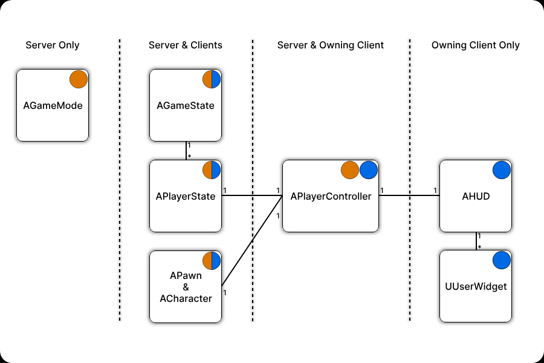

第二张图演示了具有两个连接客户端的专用服务器的示例。

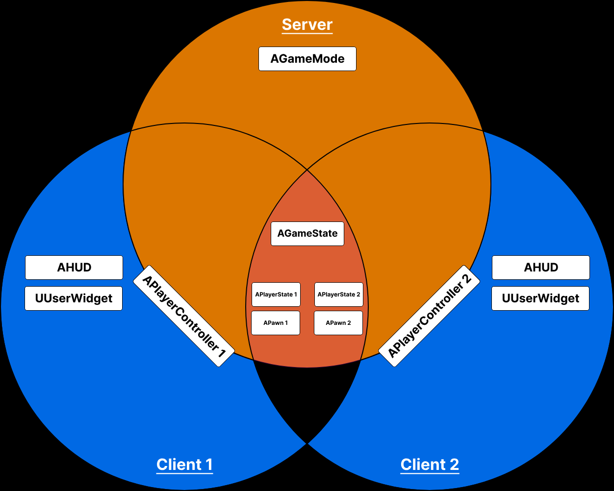

## 3、复制

之前说到过复制，但没有详细展开，这个是非常重要的内容因此拿了出来。**复制(Replication)**是指权威服务器将状态数据发送到连接的客户端的过程。如前所述，真正的游戏状态存在于服务器上。连接的客户端会将此状态 *复制* 到本地，并渲染图形和音频，以便客户端可以与其他客户端通信并参与游戏。如果正确配置了复制，不同计算机的游戏实例会同步，并且Gameplay会流畅运行。主要使用Actor和Actor派生的类通过UE中的网络连接复制其状态。`AActor` 是可以在关卡中放置或生成的对象的基类，也是UE的 `UObject` 继承层级中第一个支持用于网络的类。

`UObject` 派生的类也可以复制，但必须作为复制的子对象附加到Actor才能恰当复制。UActorComponent就是支持通过AActor复制且不需要我们做太多额外工作的UObjects的一个很好的例子。<span id="Replication">查看</span>[复制子对象](#RepUObject)

之前提到的所有类都从AActor继承，使其能够在需要时复制属性。尽管并非所有类都以相同的方式执行此操作。例如，AGameMode根本不复制，只存在于服务器上。AHUD只存在于客户端上，也不复制。

可以在 AActor 子类的类默认值/构造函数中激活复制：(只有激活复制，属性复制和RPC等有关网络的功能才可调用)

```c++
ATestActor::ATestActor()
{
    bReplicates = true;//这个变量在蓝图中的细节面板中的Replication中可以找到并更改，蓝图中也可以调用SetReplicates(true);
	//bReplicateMovement = true;在5.3中是私有变量应该调用SetReplicateMovement(bool);
}
void ATestActor::BeginPlay()
{
	Super::BeginPlay();

	SetReplicateMovement(true);//并非所有Actor都需要复制移动。
}
```

如果Actor由服务器生成，则“bReplicates”设置为**TRUE**的Actor将生成并在所有客户端上复制。并且**仅**当由服务器生成时。如果客户端生成此Actor，则该Actor将**仅存**在于该客户端上。

> <font color='red'>注意</font>：一旦为复制注册了属性，就不能将其注销。被设置需要复制的属性会在对象的生命周期内复制。复制系统嵌入了尽可能多的信息，以便系统可以跨连接中共享同一个属性集的工作，从而节省计算时间。

> 如果想了解Actor复制流程，请参阅：[Actor复制流程详解](https://dev.epicgames.com/documentation/zh-cn/unreal-engine/detailed-actor-replication-flow-in-unreal-engine?application_version=5.3)

### 属性复制

在多人游戏中，你的虚幻引擎类中可能有需要复制的属性。虚幻引擎Actor使用 `Replicated` 和 `ReplicatedUsing` 元数据说明符维护所有[属性](https://dev.epicgames.com/documentation/zh-cn/unreal-engine/unreal-engine-uproperties?application_version=5.3)的列表。在多人Gameplay中，当属性被带有 `Replicated` 或 `ReplicatedUsing` 元数据说明符标记时，服务器会在复制的属性每次更改其值时向每个连接的客户端发送更新。每个客户端会将更新的值应用到其本地版本的Actor。

`Replicated` 属性为属性复制提供了指定特定条件的选项，将属性复制限制在特定连接上。你也可以设置自定义复制条件，为属性复制定义自己的逻辑。`ReplicatedUsing` 属性需要你提供RepNotify函数，当相关属性被复制时，客户端就会调用该函数。你还可以使用 `NotReplicated` 说明符指定 *不* 复制的属性。此说明符可能一开始看起来没什么用，但在将要复制的结构体中某个属性设置为不复制时非常有用。

#### 1)为属性添加Replicated

`TestActor.h`

```c++
#pragma once

#include "CoreMinimal.h"
#include "GameFramework/Actor.h"
#include "TestActor.generated.h"

UCLASS()
class NETWORKTEACHING_API ATestActor : public AActor
{
	GENERATED_BODY()
	
public:	
	ATestActor();
	virtual void Tick(float DeltaTime) override;
	// 重载复制属性函数
	virtual void GetLifetimeReplicatedProps(TArray<FLifetimeProperty>& OutLifetimeProps) const override;

	//耐久，复制
	UPROPERTY(Replicated)
	uint32 Durability;
protected:
	virtual void BeginPlay() override;
};
```

`TestActor.cpp`

```c++
#include "TestActor.h"

#include "Net/UnrealNetwork.h"

ATestActor::ATestActor()
{
	PrimaryActorTick.bCanEverTick = false;

	bReplicates = true;
}

void ATestActor::GetLifetimeReplicatedProps(TArray<FLifetimeProperty>& OutLifetimeProps) const
{
	Super::GetLifetimeReplicatedProps(OutLifetimeProps);
	// 添加要为派生的类复制的属性
	DOREPLIFETIME(ATestActor, Durability);
}
```

蓝图就比较简单了：点击Replicated即可

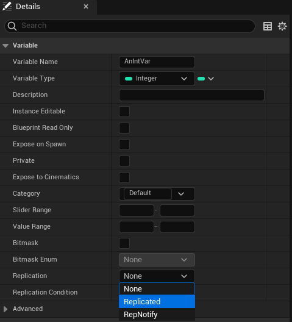

#### 2)为属性添加ReplicatedUsing

如上所示，你可以使用 `UPROPERTY` 宏中的 `Replicated` 说明符复制Actor属性。你可以使用 `ReplicatedUsing` 说明符在每次复制变量时执行特定操作。要在每次复制你的属性时执行操作，你可以使用 `ReplicatedUsing` 说明符和相关联的**RepNotify**。**RepNotify** 是复制带 `ReplicatedUsing` 说明符的属性时对客户端调用的 `OnRep_` 函数。如果你在C++中声明 `OnRep_` 函数<font color=red>必须为该函数添加“UNFUNCTION()”宏</font>

蓝图点击RepNotify即可，会自动创建RepNotify函数

`ANetworkTeachingCharacter.h`

```c++
// Copyright Epic Games, Inc. All Rights Reserved.

#pragma once

#include "CoreMinimal.h"
#include "GameFramework/Character.h"
#include "Logging/LogMacros.h"
#include "NetworkTeachingCharacter.generated.h"

DECLARE_LOG_CATEGORY_EXTERN(LogTemplateCharacter, Log, All);

UCLASS(config=Game)
class ANetworkTeachingCharacter : public ACharacter
{
	GENERATED_BODY()

public:
	ANetworkTeachingCharacter();
	virtual void GetLifetimeReplicatedProps(TArray<FLifetimeProperty>& OutLifetimeProps) const override;
	// 要使用RepNotify复制的属性
	UPROPERTY(ReplicatedUsing=OnRep_HealthUpdate)
	int32 Health;
	// Health的关联RepNotify
	UFUNCTION()
	void OnRep_HealthUpdate();
};
```

`ANetworkTeachingCharacter.cpp`

```c++
#include "NetworkTeachingCharacter.h"

#include "Net/UnrealNetwork.h"

DEFINE_LOG_CATEGORY(LogTemplateCharacter);

ANetworkTeachingCharacter::ANetworkTeachingCharacter()
{
	bReplicates = true;
}

void ANetworkTeachingCharacter::GetLifetimeReplicatedProps(TArray<FLifetimeProperty>& OutLifetimeProps) const
{
	Super::GetLifetimeReplicatedProps(OutLifetimeProps);

	DOREPLIFETIME(ANetworkTeachingCharacter, Health);
}

void ANetworkTeachingCharacter::OnRep_HealthUpdate()
{
	UE_LOG(LogTemplateCharacter, Warning, TEXT(__FUNCTION__))
}
```

另外RepNotify函数可以携带参数有两种：

`DerivedActor.h`

```c++
#pragma once 
 
#include "DerivedActor.generated.h"
 
UCLASS()
class ADerivedActor : public AActor
{
	GENERATED_BODY()
 
public:
 
	// 使用OnRep_Value复制的属性
	UPROPERTY(ReplicatedUsing=OnRep_Value)
	int32 HealthValue1;
 
	// 使用OnRep_ConstRef复制的属性
	UPROPERTY(ReplicatedUsing=OnRep_ConstRef)
	int32 HealthValue2;
 
	// 使用OnRep_NoParam复制的属性
	UPROPERTY(ReplicatedUsing=OnRep_NoParam)
	int32 HealthValue3;
 
	// 要传递最后一个值的副本的签名
	UFUNCTION()
	void OnRep_Value(int32 LastHealthValue);
 
	// 要传递常量引用的签名
	UFUNCTION()
	void OnRep_ConstRef(const int32& LastHealthValue);
 
	// 派生的Actor构造函数
	ADerivedActor();
};
```

`DerivedActor.cpp`

```c++
#include "DerivedActor.h"
#include "Net/UnrealNetwork.h"
 
ADerivedActor::ADerivedActor()
{
	bReplicates = true;
}
 
void ADerivedActor::GetLifetimeReplicatedProps(TArray<FLifetimeProperty>& OutLifetimeProps) const
{
	// 调用Super
	Super::GetLifetimeReplicatedProps(OutLifetimeProps);
 
	// 添加要为派生的类复制的属性
	DOREPLIFETIME(ADerivedActor, HealthValue1);
	DOREPLIFETIME(ADerivedActor, HealthValue2);
}
 
void ADerivedActor::OnRep_Value(int32 LastHealthValue)
{
	UE_LOG(LogTemp, Log, TEXT("OnRep_Value with value. Last value: %d"), LastHealthValue)
	// 添加自定义OnRep逻辑
}
 
void ADerivedActor::OnRep_ConstRef(const int32& LastHealthValue)
{
	UE_LOG(LogTemp, Log, TEXT("OnRep_ConstRef with const ref. Last value: %d"), *LastHealthValue)
	// 添加自定义OnRep逻辑
}
```

##### C++和蓝图中RepNotify的差异

蓝图和 C++ 处理“rep notification”概念的一个关键区别是，在蓝图中，复制的属性上的 `Set` 节点会自动调用该属性的RepNotify函数在 C++ 中，服务器*不会*自动调用RepNotify函数，只有客户端在获取更新时才会这样做。如果希望服务器调用该函数，则必须手动执行。一般来说，按引用接受属性的蓝图宏和函数不调用RepNotify，即使它们修改了值也是如此。比如蓝图中的`++`节点

此外，每当更改`Health`或其他复制变量时，都需要确保仅在服务器上进行此操作。用于检查权限的蓝图宏节点的 C++ 等效项是：

```c++
if (GetLocalRole() == ROLE_Authority)
```

所以可能的情况是

```c++
if (GetLocalRole() == ROLE_Authority)
{
    --Health;
    OnRep_HealthUpdate();
}
```

#### 3)为属性添加NotReplicated

如之前所述， `NotReplicated` 说明符可被用于标记要复制的结构体中不需复制的属性。以下代码片段展示了如何在要复制的结构体中不复制某个属性。

`DerivedActor.h`

```c++
#pragma once 
 
#include "DerivedActor.generated.h"
 
USTRUCT()
struct FMyStruct
{
	GENERATED_BODY()
 
	UPROPERTY()
	int32 ReplicatedProperty;
 
	// 不复制，尽管复制了它所在的结构体
	UPROPERTY(NotReplicated)
	int32 NotReplicatedProperty;
};
 
UCLASS()
class ADerivedActor : public AActor
{
	GENERATED_BODY()
 
public:
	UPROPERTY(Replicated)
	FMyStruct ReplicatedStruct;
 
	// 派生的Actor构造函数
	ADerivedActor();
};
```

`DerivedActor.cpp`

```c++
#include "DerivedActor.h"
#include "Net/UnrealNetwork.h"
 
ADerivedActor::ADerivedActor(const class FPostConstructInitializeProperties & PCIP) : Super(PCIP)
{
	bReplicates = true;
}
 
void ADerivedActor::GetLifetimeReplicatedProps(TArray<FLifetimeProperty>& OutLifetimeProps) const
{
	Super::GetLifetimeReplicatedProps(OutLifetimeProps);
 
	DOREPLIFETIME(ADerivedActor, ReplicatedStruct);
}
```

### 条件复制

要更精细地控制属性的复制方式，你可以使用复制条件。默认情况下，每个复制的属性仅在它发生更改时复制。未发生更改的属性不会复制，因此不会占用宝贵的带宽。

其他与上述没太大区别，只是使用不一样的宏如：

`DerviedActor.cpp`

```c++
#include "DerivedActor.h"
#include "Net/UnrealNetwork.h"
 
void ADerivedActor::GetLifetimeReplicatedProps(TArray<FLifetimeProperty>& OutLifetimeProps) const
{
	// 调用Super
	Super::GetLifetimeReplicatedProps(OutLifetimeProps);
 
	// 添加带条件的属性复制
	DOREPLIFETIME_CONDITION(ADerivedActor, Health, COND_OwnerOnly);
}
```

或者

```c++
#include "DerivedActor.h"
#include "Net/UnrealNetwork.h"
 
void ADerivedActor::GetLifetimeReplicatedProps(TArray<FLifetimeProperty>& OutLifetimeProps) const
{
	// 调用Super
	Super::GetLifetimeReplicatedProps(OutLifetimeProps);
 
	// 添加带条件的属性复制
	/** 	此项用于总是执行RepNotify
	*	在每次复制属性时在客户端上调用关联的OnRep
	*/
	DOREPLIFETIME_CONDITION_NOTIFY(ADerivedActor, Health, REPNOTIFY_Always);
 
	/** 	此项用于仅在属性更改时执行RepNotify
	*	仅在属性更改时在客户端上调用关联的OnRep
	*/
	DOREPLIFETIME_CONDITION_NOTIFY(ADerivedActor, Health, REPNOTIFY_OnChanged);
}
```

蓝图则在细节面板中Replication下面的位置：`Replication Condition`

下表为属性复制条件列表：

| **条件**                          | **说明**                                                     |
| --------------------------------- | ------------------------------------------------------------ |
| `COND_None`                       | 没有条件，一旦更改即复制。                                   |
| `COND_InitialOnly`                | 仅尝试在初始系列上复制。                                     |
| `COND_OwnerOnly`                  | 仅复制到Actor的所有者。                                      |
| `COND_SkipOwner`                  | 复制到除Actor的所有者之外的每个连接。                        |
| `COND_SimulatedOnly`              | 复制到模拟的Actor。                                          |
| `COND_AutonomousOnly`             | 仅复制到自主Actor。                                          |
| `COND_SimulatedOrPhysics`         | 复制到模拟的或 `bRepPhysics` Actor。                         |
| `COND_InitialOrOwner`             | 在初始系列上复制，或复制到Actor的所有者。                    |
| `COND_Custom`                     | 没有特定条件，但能够打开或关闭。请参阅[自定义属性复制](https://dev.epicgames.com/documentation/zh-cn/unreal-engine/replicate-actor-properties-in-unreal-engine?application_version=5.3#自定义属性复制)了解更多信息。 |
| `COND_ReplayOrOwner`              | 仅复制到重播连接或Actor的所有者。                            |
| `COND_ReplayOnly`                 | 仅复制到重播连接。                                           |
| `COND_SimulatedOnlyNoReplay`      | 仅复制到模拟的Actor，但不复制到重播连接。                    |
| `COND_SimulatedOrPhysicsNoReplay` | 复制到模拟的或 `bRepPhysics` Actor，但不复制到重播连接。     |
| `COND_SkipReplay`                 | 不复制到重播连接。                                           |
| `COND_Dynamic`                    | 在运行时重载条件。默认为总是复制，除非你将其重载为新条件。   |
| `COND_Never`                      | 从不复制。                                                   |

下表描述了虚幻引擎中可用的属性复制宏，以及：

- 调用宏的函数。
- 关联的 `FRepPropertyDescriptor` 是在编译时还是运行时构造。
- 宏是否适用于数组。

| **宏**                                            | **说明**                                                     | **在何处调用宏**             | **编译时或运行时** | **适用于数组** |
| ------------------------------------------------- | ------------------------------------------------------------ | ---------------------------- | ------------------ | -------------- |
| `DOREPLIFETIME`                                   | 复制不带条件或自定义条件的属性。                             | `GetLifetimeReplicatedProps` | 运行时             | 是             |
| `DOREPLIFETIME_WITH_PARAMS`                       | 复制带控制其复制方式的 `FDoRepLifetimeParams` 结构体的属性。 | `GetLifetimeReplicatedProps` | 运行时             | 是             |
| `DOREPLIFETIME_WITH_PARAMS_FAST`                  | 复制带控制其复制方式的 `FDoRepLifetimeParams` 结构体的属性。 | `GetLifetimeReplicatedProps` | 编译时             | 否             |
| `DOREPLIFETIME_WITH_PARAMS_FAST_STATIC_ARRAY`     | 复制带控制其复制方式的 `FDoRepLifetimeParams` 结构体的属性。 | `GetLifetimeReplicatedProps` | 编译时             | 是             |
| `DOREPLIFETIME_CONDITION`                         | 复制带 `ELifetimeCondition` 的属性。                         | `GetLifetimeReplicatedProps` | 运行时             | 是             |
| `DOREPLIFETIME_CONDITION_NOTIFY`                  | 复制带 `ELifetimeRepNotifyCondition` 的属性。                | `GetLifetimeReplicatedProps` | 运行时             | 是             |
| `DOREPLIFETIME_ACTIVE_OVERRIDE`                   | 复制带自定义条件的属性。必须伴随对 `DOREPLIFETIME_CONDITION(<CLASS>, <PROPERTY>, COND_Custom)` 的调用。 | `PreReplication`             | 运行时             | 是             |
| `DOREPLIFETIME_ACTIVE_OVERRIDE_FAST`              | 复制带自定义条件的属性。必须伴随对 `DOREPLIFETIME_CONDITION(<CLASS>, <PROPERTY>, COND_Custom)` 的调用。 | `PreReplication`             | 编译时             | 否             |
| `DOREPLIFETIME_ACTIVE_OVERRIDE_FAST_STATIC_ARRAY` | 复制带自定义条件的属性。必须伴随对 `DOREPLIFETIME_CONDITION(<CLASS>, <PROPERTY>, COND_Custom)` 的调用。 | `PreReplication`             | 编译时             | 是             |

> 如果你想更好地控制属性的复制方式，请使用相应的 `DOREPLIFETIME_WITH_PARAMS` 宏指定 `FDoRepLifetimeParams` 结构体。请记住，控制越多也意味着开销越大，请用最少的信息实现所需最大程度的控制。一般用不到。你可以在 `Engine/Source/Runtime/Engine/Public/Net/UnrealNetwork.h` 中找到这些宏的定义。
>
> 详情请参阅：[复制Actor属性-复制条件引用](https://dev.epicgames.com/documentation/en-us/unreal-engine/replicate-actor-properties-in-unreal-engine#replicationconditionreference)和[属性复制引用](https://dev.epicgames.com/documentation/en-us/unreal-engine/replicate-actor-properties-in-unreal-engine#propertyreplicationreference)

### 复制子对象

了解如何复制从<span id="RepUObject">UObject</span>派生的类及其包含的复制属性。(如果你是从上面跳转来的，[想回去](#Replication))

> 原文：[复制子对象](https://dev.epicgames.com/documentation/en-us/unreal-engine/replicated-subobjects-in-unreal-engine)
>

操作例子1：

```c++
class AMyActor : public AActor
{
    UPROPERTY(Replicated)
    UMySubObjectClass* MySubObject;
}

class UMySubObjectClass : public UObject
{
    UPROPERTY(Replicated)
    int32 Counter = 0;
}

void AMyActor::CreateMyClass()
{
    MySubObject = NewObject<UMySubObjectClass>();
    MySubObject->Counter = 10;
}

void AMyActor::ReplicateSubobjects(...)
{
    Super::ReplicateSubobjects(...);
    Channel->ReplicateSubobject(MySubObject); // 这里变为子对象
}
```

在上方代码示例中，Actor使 `MySubObject` 的内容成为了 `ReplicateSubobjects` 函数中的子对象。在该阶段，指针可进行net引用。然后，`Counter` 变量会在每次复制Actor时复制到客户端。如果我们没有通过 `Channel->ReplicateSubobject(MySubObject)` 使 `MySubObject` 成为子对象，`MySubObject` 变量在客户端上始终会是 `null`。

操作例子2：以下代码示例概述了如何启用注册子对象列表。(**注册子对象列表概述**：Actor现在有方法将子对象注册到所属Actor或Actor组件上的列表，并由Actor通道自动处理这些注册子对象的复制工作。注册子对象列表允许在注册子对象时为其指定 ELifetimeCondition。该过程可更好地控制何时将子对象复制到何处，而无需用户在 ReplicateSubobjects 中实现此逻辑。此外，Actor也无需实现虚拟函数 AActor::ReplicateSubobjects 并手动复制单独的子对象。)

```c++
AMyActor::AMyActor()
{
    bReplicateUsingRegisteredSubObjectList = true;
}

void AMyActor::CleanupSubobject()
{
    if (MySubobject)
    {
        RemoveReplicatedSubobject(MySubObject);
    }
}

void AMyActor::CreateMyClass()
{
    CleanupSubobject();

    MySubObject= NewObject<UMySubObjectClass>();
    MySubObject->Counter = 10;
    AddReplicatedSubObject(MySubObject);
}

void AMyActor::CreateMyDerivedClass()
{
    CleanupSubobject();

    MySubObject = NewObject<UMyDerivedSubObjectClass>();
    AddReplicatedSubObject(MySubObject);
}
```

在 `ReadyForReplication`、`BeginPlay` 中或在创建新的子对象时调用 `AddReplicatedSubObject` 。

在Actor组件类中，`ReadyForReplication` 在 `InitComponent` 和 `BeginPlay` 之间调用。这里注册组件后，该组件就可以在组件的 `BeginPlay` 中及早调用远程程序调用（RPC）。

每当修改或删除子对象时，请调用 `RemoveReplicatedSubObject` 。如上例代码`CleanupSubobject()`

> <font color=red>这最后一步非常重要。除非删除引用，否则列表仍包含指向已更改或标记为破坏的子对象的原始指针。因此，这会在对象被垃圾回收之后导致崩溃。</font>

### 复制Actor组件

```c++
ELifetimeCondition AMyWeaponClass::AllowActorComponentToReplicate(const UActorComponent* ComponentToReplicate) const
{
    // Do not replicate some components while the object is on the ground.
    if (!bIsInInventory)
    {
        if (IsA<UDamageComponent>(ComponentToReplicate))
        {
            return COND_Never;
        }
    }
    Super::AllowActorComponentToReplicate(ComponentToReplicate);
}

void AMyWeaponClass::OnPickup()
{
    // Now replicate the component to all
    SetReplicatedComponentNetCondition(UDamageComponent, COND_None);
    bIsInInventory = true;
}
```

在上面的例子中，所属Actor类是 `AMyWeaponClass` 。我们需要根据武器当前是否在Actor的物品栏中，来设置 `UActorComponent ComponentToReplicate` 的复制条件。为完成该操作，所属Actor类 `AMyWeaponClass` 实现了 `AllowComponentToReplicate` 。

武器在地面时，它不在Actor的物品栏中。因此，我们不希望复制伤害组件。这种情况下返回的 `ELifetimeCondition` 是 `COND_Never` ，它会指定永不复制这些组件。我们想更改伤害组件的条件时，例如武器被捡起时，会直接调用 `SetReplicatedComponentCondition` ，将复制条件设置为 `COND_None` ，这表示始终会复制组件。

> 注：所属组件必须在检查其复制子对象的条件之前复制到连接。例如，如果子对象有 `COND_OwnerOnly` 条件，当它注册到使用 `COND_SkipOwner` 条件的组件时，绝不会复制该子对象。
>

## 4、RPC

RPC （远程过程调用 / **Remote Procedure Calls / RPCs**）是在本地调用但在其他机器上远程执行的函数。RPC 函数非常有用，可允许客户端或服务器通过网络连接相互发送消息。

这些功能的主要作用是执行那些不可靠的短暂/修饰性游戏事件。这其中包括播放声音、生成粒子或执行动画之类的事件。

在使用 RPC 时，还必须要了解 [所有权的工作方式](https://dev.epicgames.com/documentation/zh-cn/unreal-engine/actor-owner-and-owning-connection-in-unreal-engine?application_version=5.3)，因为所有权决定了 RPC 远程执行的位置。后面会说。

### RPC 的类型

下表概述了三种不同类型的 RPC：

| **元数据说明符** | **描述**                                                     |
| ---------------- | ------------------------------------------------------------ |
| `Client`         | RPC 在该参与者的拥有客户端连接上执行。                       |
| `Server`         | RPC 在服务器上执行。                                         |
| `NetMulticast`   | RPC 在服务器和该参与者相关的所有当前连接的客户端上执行。从客户端调用的 RPC 仅在本地执行。 |

### RPC的使用

`DerivedActor.h`

```c++
#pragma once

#include "DerivedActor.generated.h"

UCLASS()
class ADerivedActor : public AActor
{
 GENERATED_BODY()

public:

 // Client RPC Function
 UFUNCTION(Client)
 void ClientRPC();

 // Server RPC Function
 UFUNCTION(Server)
 void ServerRPC();

 // Multicast RPC Function
 UFUNCTION(NetMulticast)
 void MulticastRPC();
}
```

> 按照惯例，在 RPC 函数名称前面加上 RPC类型：
>
> - `Client`用于客户端 RPC 功能。
> - `Server`用于服务器 RPC 功能。
> - `Multicast`用于网络多播 RPC 功能。
>
> 这对于一眼判断多人游戏会话期间该函数调用适用于哪些机器很有用。

`DerivedActor.cpp`

```c++
#include "DerivedActor.h"

void ADerivedActor::ClientRPC_Implementation()
{
 // This log will print on every machine that executes this function.
 UE_LOG(LogTemp, Log, TEXT("ClientRPC executed."))
}

void ADerivedActor::ServerRPC_Implementation()
{	
 // This function only executes if ServerRPC_Validate returns true.
 // This log will print on every machine that executes this function.
 UE_LOG(LogTemp, Log, TEXT("ServerRPC executed."))
}

void ADerivedActor::MulticastRPC_Implementation()
{
 // This log will print on every machine that executes this function.
 UE_LOG(LogTemp, Log, TEXT("MulticastRPC executed."))	
}
```

调用RPC函数

```c++
// Call from client to run on server
ADerivedClientActor* MyDerivedClientActor;
MyDerivedClientActor->ServerRPC();

// Call from server to run on client
ADerivedServerActor* MyDerivedServerActor;
MyDerivedServerActor->ClientRPC();

// Call from server to run on server and all relevant clients
ADerviedMultiActor* MyDerivedMultiActor;
MyDerievedMultiActor->MulticastRPC();
```

> `Client`和`Server`RPC 都是单播 RPC。*单播*RPC 之所以如此命名，是因为它们在一台机器上执行。`NetMulticast`*多播*RPC是因为它可以在多台机器上执行。

### RPC调用关系

首先必须满足一些要求才能充分发挥 RPC 的作用：

1. 它们必须从 Actor 上调用。
2. Actor 必须被复制。
3. 如果 RPC 是从服务器调用并在客户端上执行，则只有实际拥有这个 Actor 的客户端才会执行函数。
4. 如果 RPC 是从客户端调用并在服务器上执行，客户端就必须拥有调用 RPC 的 Actor。
5. 多播 RPC 则是个例外：
   - 如果它们是从服务器调用，服务器将在本地和所有已连接的客户端上执行它们。
   - 如果它们是从客户端调用，则只在本地而非服务器上执行。
   - 现在，我们有了一个简单的多播事件限制机制：在特定 Actor 的网络更新期内，多播函数将不会复制两次以上。

下面的表格根据执行调用的 actor 的所有权（最左边的一列），总结了特定类型的 RPC 将在哪里执行。

#### 从服务器调用的 RPC

| Actor 所有权           | 未复制         | `NetMulticast`             | `Server`       | `Client`                    |
| ---------------------- | -------------- | -------------------------- | -------------- | --------------------------- |
| **Client-owned actor** | 在服务器上运行 | 在服务器和所有客户端上运行 | 在服务器上运行 | 在 actor 的所属客户端上运行 |
| **Server-owned actor** | 在服务器上运行 | 在服务器和所有客户端上运行 | 在服务器上运行 | 在服务器上运行              |
| **Unowned actor**      | 在服务器上运行 | 在服务器和所有客户端上运行 | 在服务器上运行 | 在服务器上运行              |

#### 从客户端调用的 RPC

| Actor 所有权                    | 未复制                   | `NetMulticast`           | `Server`       | `Client`                 |
| ------------------------------- | ------------------------ | ------------------------ | -------------- | ------------------------ |
| **Owned by invoking client**    | 在执行调用的客户端上运行 | 在执行调用的客户端上运行 | 在服务器上运行 | 在执行调用的客户端上运行 |
| **Owned by a different client** | 在执行调用的客户端上运行 | 在执行调用的客户端上运行 | 丢弃           | 在执行调用的客户端上运行 |
| **Server-owned actor**          | 在执行调用的客户端上运行 | 在执行调用的客户端上运行 | 丢弃           | 在执行调用的客户端上运行 |
| **Unowned actor**               | 在执行调用的客户端上运行 | 在执行调用的客户端上运行 | 丢弃           | 在执行调用的客户端上运行 |

> 更详细的表格请参阅：[Matrix of RPC Execution](https://dev.epicgames.com/documentation/en-us/unreal-engine/remote-procedure-calls-in-unreal-engine#matrixofrpcexecution)

### 可靠性

虚幻引擎中的 RPC 被标记为可靠或不可靠：

| **元数据说明符** | **描述**                                                     | **执行顺序**   |
| ---------------- | ------------------------------------------------------------ | -------------- |
| `Reliable`       | 此 RPC 会重新发送，直到接收方确认。所有后续 RPC 执行都会暂停，直到此 RPC 得到确认。 | 保证按序排列。 |
| `Unreliable`     | 如果数据包被丢弃，则不会再次执行此 RPC。                     | 沒有顺序保证。 |

> 默认情况下，RPC 是不可靠的。可靠的 RPC 需要额外的带宽，因此请谨慎使用它们。虚幻引擎 (UE) 的网络复制使用可靠和不可靠通信方法的组合在服务器和连接的客户端之间传输信息。*可靠*通信会持续发送，暂停所有其他网络通信，直到接收机器确认。如果接收机器未确认接收，则在当前网络周期内发送不可靠通信，并且不会重新发送。虚幻引擎中的复制系统尽可能可靠地执行 RPC，因此可以构建游戏系统而不必担心网络副作用。
>
> 不要将每个 RPC 都标记为可靠！只应对偶尔调用的 RPC 执行此操作，并且需要它们到达目的地。在 Tick 上调用可靠的 RPC 可能会产生副作用，例如填充可靠缓冲区，这可能导致其他属性和 RPC 不再被处理。
>
> 有关虚幻引擎中复制执行顺序保证的更多信息，请参阅[复制对象执行顺序](https://dev.epicgames.com/documentation/en-us/unreal-engine/replicated-object-execution-order-in-unreal-engine?application_version=5.3)文档。

#### 指定 RPC 可靠性

要指定 RPC 的可靠性，为 RPC 添加适当的元数据说明符：

`DerivedActor.h`

```c++
#pragma once

#include "DerivedActor.generated.h"

UCLASS()
class ADerivedActor : public AActor
{
    GENERATED_BODY()

public:	
    // Client Default Unreliable RPC Function
    UFUNCTION(Client)
    void ClientDefaultUnreliableRPC();

    // Client Unreliable RPC Function
    UFUNCTION(Client, Unreliable)
    void ClientUnreliableRPC();

    // Client Reliable RPC Function
    UFUNCTION(Client, Reliable)
    void ClientReliableRPC();
}
```

### Server RPC 验证

Server RPC 验证实施*信任和验证*网络策略。服务器信任客户端与其通信的信息，但始终验证此信息是否遵循服务器上游戏定义的规则和约束。(信任这部分后面再说)

可以使用`WithValidation` `UFUNCTION`元数据标记Server RPC，并定义相应的Server RPC 验证函数。验证函数的名称与 RPC 函数相同，但在函数名称末尾附加了`_Validate` 。返回类型为布尔值，它采用与其关联的 RPC 函数相同的参数。验证函数可帮助服务器根据你定义的验证逻辑确定是否应该运行 RPC。当客户端发出调用以执行Server RPC时，将首先在服务器上调用验证函数。

根据验证函数的输出，会发生以下情况：

- 如果输入通过验证，则调用实现。
- 如果输入验证失败，调用客户端将与服务器<font color=red>断开连接(被踢出服务器)</font>。

#### 添加验证实施

要为 RPC 添加验证功能，请按照以下步骤操作：

`DerivedActor.h`

```c++
#pragma once

#include "DerivedActor.generated.h"

UCLASS()
class ADerivedActor : public AActor
{
 GENERATED_BODY()

public:
 UPROPERTY(Replicated)
 int32 Health;
 int32 MAXHEALTH = 100;

 // Server Unreliable RPC Function
 UFUNCTION(Server, Unreliable, WithValidation)
 void ServerUnreliableRPC(int32 RecoverHealth); 
}
```

`DerivedActor.cpp`

```c++
#include "DerivedActor.h"

// RPC Validation Implementation
bool ServerUnreliableRPC_Validate(int32 RecoverHealth)
{
 if (Health + RecoverHealth > MAXHEALTH)
 {
     return false;
 }
return true;
}

// RPC Implementation
void ServerUnreliableRPC_Implementation(int32 RecoverHealth)
{
 Health += RecoverHealth;
}
```

### 蓝图中的 RPC

C++ 中的 RPC 所具有的相同类型的 RPC、可靠性选项和执行逻辑也存在于 Blueprint 中的 RPC 中。要创建复制的 Blueprint 事件，请按照以下步骤操作：

1. 创建或打开蓝图 Actor 或 Actor 派生类。
2. 确保蓝图的**详细信息面板**中的**复制**设置为**True**。
3. 右键单击并选择**添加事件>添加自定义事件…(Add Custom Event...)**
4. 单击**CustomEvent**节点以调出**详细信息面板**。
5. **可以在“详细信息面板”>“图表”>“复制”**下选择事件是否复制、使用哪种复制类型以及是否可靠。

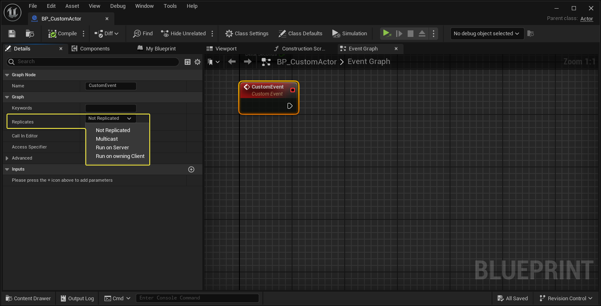
6. 选择所需的设置后，在蓝图中定义 RPC 功能即可。

## 5、Actor Ownership

为什么要知道Actor的所属关系呢，以及我们为什么需要它？

1. RPC 需要确定哪个客户端将执行 Run-On-Client RPC
2. Actor 复制和连接相关性
3. 所有者参与时的参与者属性复制条件

1、Actor的 *所属连接* 是与Actor的所属玩家控制器关联的连接。所有者和所属连接将确定哪个所连接客户端有权做出更改和调用远程函数。

2、Actor的所属连接在Actor复制期间用于确定哪些连接获得Actor的更新，这就是[Actor相关性](https://dev.epicgames.com/documentation/zh-cn/unreal-engine/actor-relevancy-in-unreal-engine?application_version=5.3)。对于[`bOnlyRelevantToOwner`](https://dev.epicgames.com/documentation/en-us/unreal-engine/API/Runtime/Engine/GameFramework/AActor/bOnlyRelevantToOwner?application_version=5.3)设置为true的Actor，只有拥有该Actor的连接才会收到该Actor的属性更新。默认情况下，所有玩家控制器仅与其所有者相关。正因为如此，每个客户端仅会收到自身玩家控制器的更新。

3、若属性复制期间涉及的条件会使用所有者，将使用Actor的所属连接。(条件复制)

每个 `AActor` 派生的对象将存储其所有者的指针。并非每个 `AActor` 派生的对象都有所有者。Actor的所有者可以为null，在这种情况下，Actor没有所有者。

> 要确定Actor的所有者，请查询Actor的最外层所有者。如果最外层所有者是玩家控制器，则原始Actor的所属连接与玩家控制器的所属连接相同。
>
> 要获取Actor的所有者，请调用[`AActor::GetOwner`](https://dev.epicgames.com/documentation/en-us/unreal-engine/API/Runtime/Engine/GameFramework/AActor/GetOwner?application_version=5.3)。
>
> 要获取Actor组件的所属Actor，请调用[`UActorComponent::GetOwner`](https://dev.epicgames.com/documentation/en-us/unreal-engine/API/Runtime/Engine/Components/UActorComponent/GetOwner?application_version=5.3)。
>
> 要获取Actor的所属连接，请调用[`AActor::GetNetConnection`](https://dev.epicgames.com/documentation/en-us/unreal-engine/API/Runtime/Engine/GameFramework/AActor/GetNetConnection?application_version=5.3)。

每个“连接”都有一个专为该连接创建的 PlayerController。为此创建的 PlayerController 由该连接拥有。因此，当我们想要确定某个 Actor 是否归某人所有时，我们会向上（递归）查询，直到到达最外层的所有者，如果这是一个 PlayerController，那么拥有该 PlayerController 的连接也拥有该 Actor。

```c++
UNetConnection* AActor::GetNetConnection() const
{
	return Owner ? Owner->GetNetConnection() : nullptr;
}
```

```c++
UNetConnection* APlayerController::GetNetConnection() const
{
	// A controller without a player has no "owner"
	return (Player != NULL) ? NetConnection : NULL;
}
```

举个栗子：一个是本地玩家（客户端）拥有的 PlayerController。另一个是场景中生成/放置的门。这将主要归服务器所有。那么如果客户端在他们不拥有的 Actor 上调用服务器 RPC，则该服务器 RPC 将被丢弃。因此客户端无法在服务器拥有的门上调用“Server_Interact”。那么我们如何解决这个问题呢？我们使用客户端拥有的类/Actor，即 PlayerController 发送一个 RPC 通知Server。

## 6、Actor的相关性与优先级

蓝图与C++部分设置：

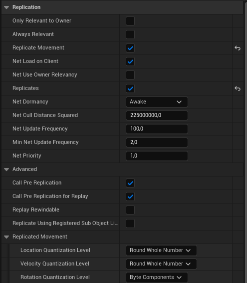

```c++
bOnlyRelevantToOwner = false;
bAlwaysRelevant = false;
bReplicateMovement = true;
bNetLoadOnClient = true;
bNetUseOwnerRelevancy = false;
bReplicates = true;
NetUpdateFrequency = 100.f;
NetCullDistanceSquared = 225000000.f;
NetPriority = 1.f;
```

### Relevancy

虚幻引擎关卡可能非常庞大。在特定时刻某个玩家只能看到关卡中的一小部分Actor。场景中的其他大多数Actor都不会被看到和听到，对玩家也不会产生显著的影响。被服务器认为能够对客户端产生重大影响的Actor组会被视为与该客户端的 **相关**。这组相关Actor按客户端确定，用网络术语来说，即按网络连接确定。虚幻引擎只会将与客户端相关的Actor复制到该客户端。

> 当动态生成的已复制Actor不再相关时，会在客户端上被销毁。所以次Actor在此情况下不再对主Actor可见。
>

#### 确定相关性

网络驱动程序通过调用[`AActor::IsNetRelevantFor`](https://dev.epicgames.com/documentation/en-us/unreal-engine/API/Runtime/Engine/GameFramework/AActor/IsNetRelevantFor?application_version=5.3)，确定Actor是否与特定网络连接相关。这由网络驱动程序自动处理。这个函数是个虚函数可以进行重写(Override)。例如：

`ActorReplication.cpp`

```c++
bool AActor::IsNetRelevantFor(const AActor* RealViewer, const AActor* ViewTarget, const FVector& SrcLocation) const
{
	if (bAlwaysRelevant || IsOwnedBy(ViewTarget) || IsOwnedBy(RealViewer) || this == ViewTarget || ViewTarget == GetInstigator())
	{
		return true;
	}
	else if (bNetUseOwnerRelevancy && Owner)
	{
		return Owner->IsNetRelevantFor(RealViewer, ViewTarget, SrcLocation);
	}
	else if (bOnlyRelevantToOwner)
	{
		return false;
	}
	else if (RootComponent && RootComponent->GetAttachParent() && RootComponent->GetAttachParent()->GetOwner() && (Cast<USkeletalMeshComponent>(RootComponent->GetAttachParent()) || (RootComponent->GetAttachParent()->GetOwner() == Owner)))
	{
		return RootComponent->GetAttachParent()->GetOwner()->IsNetRelevantFor(RealViewer, ViewTarget, SrcLocation);
	}
	else if(IsHidden() && (!RootComponent || !RootComponent->IsCollisionEnabled()))
	{
		return false;
	}

	if (!RootComponent)
	{
		UE_LOG(LogNet, Warning, TEXT("Actor %s / %s has no root component in AActor::IsNetRelevantFor. (Make bAlwaysRelevant=true?)"), *GetClass()->GetName(), *GetName() );
		return false;
	}

	return !GetDefault<AGameNetworkManager>()->bUseDistanceBasedRelevancy ||
			IsWithinNetRelevancyDistance(SrcLocation);
}
```

`PlayerController.cpp`

```c++
bool APlayerController::IsNetRelevantFor(const AActor* RealViewer, const AActor* ViewTarget, const FVector& SrcLocation) const
{
	return ( this==RealViewer );
}
```

> <font color=yellow>重载 `AActor::IsNetRelevantFor` 时请谨慎。如果你不熟悉虚幻引擎的复制系统，这可能带来意外后果。</font>

`AActor::IsNetRelevantFor` 使用三个参数来确定调用Actor对象是否相关：

| **参数**      | **说明**                                                     |
| ------------- | ------------------------------------------------------------ |
| `RealViewer`  | 客户端网络对象，控制需要检查相关性的当前Actor。这通常是玩家手柄。 |
| `ViewTarget`  | `RealViewer` 当前查看或控制的Actor。这通常是Pawn。           |
| `SrcLocation` | 控制网络对象的源位置。这在启用基于距离的相关性时使用。       |

 由上述代码可见，虚函数 `AActor::IsNetRelevantFor` 实现了多个测试，用于确定与网络连接相关的一组Actor。对于给定的Actor和网络连接，会执行以下测试：

- 如果以下条件至少有一个成立，则当前Actor与此网络连接相关：
  - 当前Actor始终相关。（Actor 被标记为“bAlwaysRelevant”）
  - 当前Actor由当前网络连接的Pawn拥有。
  - 当前Actor由当前网络连接的玩家手柄拥有。
  - 当前Actor是当前网络连接的Pawn。
  - 当前网络连接的Pawn是某个操作（例如声音或伤害）的发起者。
- 如果以下条件都成立，则复制系统使用当前Actor的所有者的相关性来确定它与此网络连接是否相关：
  - 当前Actor有所有者。
  - 当前Actor被设置为使用其所有者的网络相关性。（Actor 被标记为“bNetUserOwnerRelevancy”）
- 如果以下条件都成立，则当前Actor与此网络连接不相关：
  - 当前Actor仅与其所有者相关。（Actor 被标记为“bOnlyRelevantToOwner”）
  - 当前Actor没有所有者。或当前Actor的所有者不相关。
- 如果以下条件成立，则系统使用当前Actor的基本相关性来确定它与此网络连接是否相关：
  - 当前Actor被附加到了另一个Actor的骨架。
- 如果以下条件都成立，则当前Actor与此网络连接不相关：
  - 当前Actor已被隐藏。（‘bHidden == true’）
  - 当前Actor没有根组件，或根组件未启用碰撞。

- 如果以下条件都成立，则当前Actor与此网络连接相关：
  - 游戏网络管理器（[`AGameNetworkManager`](https://dev.epicgames.com/documentation/en-us/unreal-engine/API/Runtime/Engine/GameFramework/AGameNetworkManager?application_version=5.3)）被设置为使用基于距离的相关性。
  - 当前Actor在相关性距离内。

> <font color=yellow>如果当前Actor没有根组件，则 `AActor::IsNetRelevantFor` 会记录警告，并询问该Actor是否应该始终相关。</font>

> 此外正如上述，由于`AActor::IsNetRelevantFor` 可以重写因此这些测试适用于 `AActor` 基类。`AActor` 派生的其他类可能包含不同的网络相关性逻辑。例如，`APawn` 和 `APlayerController` 类会重载 `AActor::IsNetRelevantFor` 。因此，它们有不同的相关性条件。请参阅 `Pawn.cpp` 和 `PlayerController.cpp` ，了解更多信息。
>

> 我们还可以在 `AActor` 派生的类中调用[`AActor::ForceNetRelevant`](https://dev.epicgames.com/documentation/en-us/unreal-engine/API/Runtime/Engine/GameFramework/AActor/ForceNetRelevant?application_version=5.3)，将任意Actor强制设为相关。
>

> 与Actor相关性有关的函数和属性，请参阅[相关性参考](https://dev.epicgames.com/documentation/zh-cn/unreal-engine/actor-relevancy-in-unreal-engine#相关性参考)
>

### Prioritization

虚幻引擎无法保证在网络更新期间所有Actor都会被复制。这是因为网络资源有限。网络连接的带宽是其中的主要限制因素。网络连接的 *带宽* 是该网络连接的最大数据传输容量。超出容量后，网络连接会进入 *饱和* 状态。网络连接饱和之后，**虚幻引擎的复制系统会使用一种负载均衡技术**，为所有Actor分配一个数字 **优先级** 。此优先级会根据每个Actor对于Gameplay的重要程度以及可用的网络带宽资源，给予合理的带宽份额。Actor的相对优先级越高，就表示越有必要复制，因此会获得更多带宽进行复制。

每个Actor都有一个浮点[`AActor::NetPriority`](https://dev.epicgames.com/documentation/en-us/unreal-engine/API/Runtime/Engine/GameFramework/AActor?application_version=5.3)属性。`NetPriority` 越高，就表示这个Actor比其他Actor拥有更多带宽。例如， `NetPriority == 2.0` 的Actor会获得比 `NetPriority == 1.0` 的Actor更多的资源。就优先级而言，唯一重要的是比率；提升所有Actor的网络优先级并不能提高虚幻引擎的网络性能。

Actor 的当前优先级是使用虚拟函数`AActor::GetNetPriority()`计算的，这由网络驱动程序自动处理。为了避免资源匮乏，`AActor::GetNetPriority()`将`NetPriority`乘以 Actor 最后一次复制到现在的时间。另外还考虑了此Actor与观看者的距离等因素。

此外你也可以自定义Actor优先级，方法是重载 `AActor` 派生的类中的虚函数 `GetNetPriority` ，并使用 `NetPriority` 更改基本网络优先级。

`ActorReplication.cpp`

```c++
float AActor::GetNetPriority(const FVector& ViewPos, const FVector& ViewDir, AActor* Viewer, AActor* ViewTarget, UActorChannel* InChannel, float Time, bool bLowBandwidth)
{
	if (bNetUseOwnerRelevancy && Owner)
	{
		// If we should use our owner's priority, pass it through
		return Owner->GetNetPriority(ViewPos, ViewDir, Viewer, ViewTarget, InChannel, Time, bLowBandwidth);
	}

	if (ViewTarget && (this == ViewTarget || GetInstigator() == ViewTarget))
	{
		// If we're the view target or owned by the view target, use a high priority
		Time *= 4.f;
	}
	else if (!IsHidden() && GetRootComponent() != NULL)
	{
		// If this actor has a location, adjust priority based on location
		FVector Dir = GetActorLocation() - ViewPos;
		float DistSq = Dir.SizeSquared();

		// Adjust priority based on distance and whether actor is in front of viewer
		if ((ViewDir | Dir) < 0.f)
		{
			if (DistSq > NEARSIGHTTHRESHOLDSQUARED)
			{
				Time *= 0.2f;
			}
			else if (DistSq > CLOSEPROXIMITYSQUARED)
			{
				Time *= 0.4f;
			}
		}
		else if ((DistSq < FARSIGHTTHRESHOLDSQUARED) && (FMath::Square(ViewDir | Dir) > 0.5f * DistSq))
		{
			// Compute the amount of distance along the ViewDir vector. Dir is not normalized
			// Increase priority if we're being looked directly at
			Time *= 2.f;
		}
		else if (DistSq > MEDSIGHTTHRESHOLDSQUARED)
		{
			Time *= 0.4f;
		}
	}

	return NetPriority * Time;
}
```

翻译代码，网络优先级按如下逻辑确定：

- 如果以下两个条件都成立，则当前Actor使用其所有者的网络优先级。
  - 当前Actor有所有者。
  - 当前Actor被设置为使用其所有者的网络相关性。
- 如果以下条件至少有一个成立，则当前Actor的网络优先级将提高。
  - 当前Actor是当前网络连接的Pawn。
  - 当前网络连接的Pawn是某个操作的发起者。
- 如果以上两点均不成立，则执行基于距离的计算，以确定当前Actor的网络优先级：
  - 如果当前Actor在观看者前方，则优先级与设定距离成反比降低。
    - 如果当前Actor与观看者之间的距离大于 `CLOSEPROXIMITY` ，但小于 `NEARSIGHTTHRESHOLD` ，则优先级会乘以 `0.2` 。
    - 如果当前Actor与观看者之间的距离大于 `NEARSIGHTTHRESHOLD` ，则优先级会乘以 `0.4` 。
  - 如果当前Actor与观看者之间的距离小于 `FARSIGHTTHRESHOLD` ，并且观看者正在看当前Actor，则优先级会乘以 `2.0` 。
  - 如果当前Actor与观看者之间的距离大于 `MEDSIGHTTHRESHOLD` ，则优先级会乘以 `0.4` 。

> 详情请参阅[Actor优先级](https://dev.epicgames.com/documentation/zh-cn/unreal-engine/actor-priority-in-unreal-engine?application_version=5.3)

## 7、Actor‘s Role and RemoteRole

在 Actor 的复制过程中，有两个属性扮演了重要角色，分别是 **Role** 和 **RemoteRole**。

有了这两个属性，你可以知道：

- 谁拥有 actor 的主控权
- actor 是否被复制
- 复制的模式

这个和之前讲的所属性有点像，但是完全不同。

首先一件要确定的事，就是谁拥有特定 actor 的主控权。要确定当前运行的引擎实例是否有主控者，需要查看 Role 属性是否为 `ROLE_Authority`。如果是，就表明这个运行中的 **虚幻引擎** 实例负责掌管此 actor（决定其是否被复制）。就目前而言，只有服务器能够向已连接的客户端同步 Actor （客户端永远都不能向服务器同步）。始终记住这一点， *只有* 服务器才能看到 `Role == ROLE_Authority` 和 `RemoteRole == ROLE_SimulatedProxy` 或者 `ROLE_AutonomousProxy`。

> 看到这里你应该就明白两者不同，Ownership是为了确定Actor所属，而这个是Actor在某个机器的网络中扮演的什么身份。

`EngineTypes.h`

```c++
/** The network role of an actor on a local/remote network context */
UENUM()
enum ENetRole : int
{
	/** No role at all. */
	ROLE_None,
	/** Locally simulated proxy of this actor. */
	ROLE_SimulatedProxy,
	/** Locally autonomous proxy of this actor. */
	ROLE_AutonomousProxy,
	/** Authoritative control over the actor. */
	ROLE_Authority,
	ROLE_MAX,
};
```

### 复制模式

服务器不会在每次更新时复制 actor。这会消耗太多的带宽和 CPU 资源。实际上，服务器会按照 `AActor::NetUpdateFrequency` 属性指定的频度来复制 actor。因此在 actor 更新的间歇，会有一些时间数据被传递到客户端。这会导致 actor 呈现出断续、不连贯的移动。为了弥补这个缺陷，客户端将在更新的间歇中模拟 actor。

目前共有两种类型的模拟。

#### `ROLE_SimulatedProxy`

这是标准的模拟途径，通常是根据上次获得的速率对移动进行推算。当服务器为特定的 actor 发送更新时，客户端将向着新的方位调整其位置，然后利用更新的间歇，根据由服务器发送的最近的速率值来继续移动 actor。

使用上次获得的速率值进行模拟，只是普通模拟方式中的一种。您完全可以编写自己的定制代码，在服务器更新的间隔使用其他的一些信息来进行推算。（比如几个网络包与当前包的模拟整合使更加丝滑与缩小现实误差）

#### `ROLE_AutonomousProxy`

这种模拟通常只用于 PlayerController 所拥有的 actor。这说明此 actor 会接收来自真人控制者的输入，所以在我们进行推算时，我们会有更多一些的信息，而且能使用真人输入内容来补足缺失的信息（而不是根据上次获得的速率来进行推算）。

> 此时，你就会有客户端电脑和服务器上不同实例的运行方式，而且视觉观感处理方式也不同。

哎，不对啊，还有一个`ROLE_None`啊。这个是在Actor不参与复制时并且是在客户端上的身份，才会出现的情况。

## 8、多人游戏中的关卡切换

> 参考：[UE4流关卡与无缝地图切换总结](https://gwb.tencent.com/community/detail/121543)

**虚幻引擎（UE）** 中主要有两种转移方式：**无缝** 和 **非无缝方式**。两者的主要区别在于，**无缝** 转移是一种非阻塞（non-blocking）操作，而 **非无缝** 转移则是一种阻塞（blocking）操作。

当客户端执行非无缝转移时，客户端将与服务器断开连接，然后重新连接到同一服务器，而服务器将准备新的地图以供加载。

Epic建议虚幻引擎多人模式游戏尽量采用无缝转移。这样做通常可以提供更流畅的体验，同时避免重新连接过程中可能出现的问题。

但是有三种情形中必然产生非无缝转移：

- 初次加载地图时
- 初次作为客户端连接服务器时
- 想要终止一个多人模式游戏并启动新游戏时

有三个用来驱动转移的主要函数：`UEngine::Browse`、`UWorld::ServerTravel` 和 `APlayerController::ClientTravel`。

`UEngine::Browse`

- 就像是加载新地图时的硬重置。
- 将始终导致非无缝切换。
- 将导致服务器在切换到目标地图前与当前客户端断开连接。
- 客户端将与当前服务器断开连接。
- 专用服务器无法切换至其他服务器，因此地图必须存储在本地（不能是 URL）。

`UWorld::ServerTravel`

<iframe src="https://img-blog.csdnimg.cn/20210223162537742.png?x-oss-process=image/watermark,type_ZmFuZ3poZW5naGVpdGk,shadow_10,text_aHR0cHM6Ly9ibG9nLmNzZG4ubmV0L3Fxb29vcHAxMjM=,size_16,color_FFFFFF,t_70" scrolling="no" allowfullscreen></iframe>

command 中的 servertravel 后面要加空格

- 仅适用于服务器。
- 会将服务器跳转到新的世界/场景。
- 所有连接的客户端都会跟随。
- 这就是多人游戏在地图之间转移时所用的方法，而服务器将负责调用此函数。
- 服务器将为所有已连接的客户端玩家调用 `APlayerController::ClientTravel`。

`APlayerController::ClientTravel`

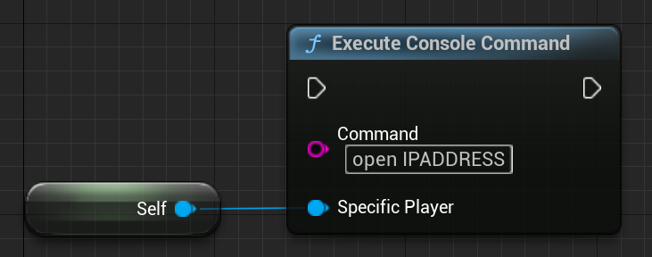

```c++
// Assuming you are not already in the PlayerController (if you are, just call ClientTravel directly)
APlayerController* PlayerController = UGameplayStatics::GetPlayerController(GetWorld(), 0);
PlayerController->ClientTravel(“IPADDRESS”, ETravelType::TRAVEL_Absolute);
```

- 如果从客户端调用，则转移到新的服务器
- 如果从服务器调用，则要求特定客户端转移到新地图（但仍然连接到当前服务器）

要启用无缝切换，需要设置一个过渡地图。`Transition Map`

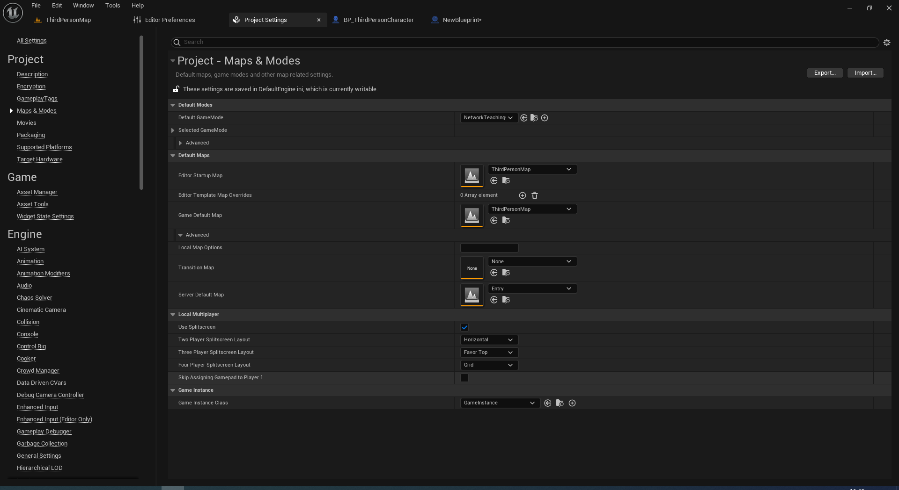

设置好过渡地图后，需要将 `AGameModeBase::bUseSeamlessTravel` 设置为 true，这样就可以实现无缝切换了！或者在Game Mode蓝图的细节面板中找到`bUseSeamlessTravel`并设置为True；

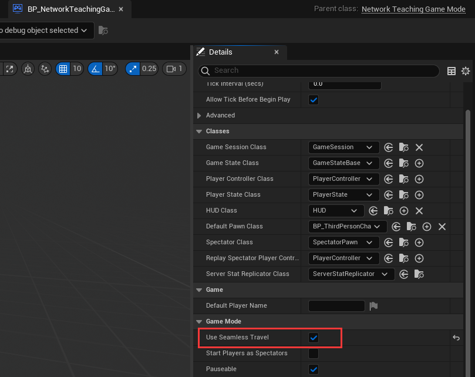

在使用无缝切换时，可以将(存留)actor从当前关卡带到新的关卡。这适用于一些特定的 actor，如道具栏物品和玩家等。

默认情况下，这些 actor 将自动存留：

- `GameMode`的actor（仅限服务器）
  - 通过 `AGameModeBase::GetSeamlessTravelActorList` 额外添加的任何 actor
- 拥有一个有效的 `PlayerState` （仅限服务器）的所有控制器
- 所有 `PlayerControllers` （仅限服务器）
- 所有本地`PlayerControllers`（服务器和客户端）
  - 通过 `APlayerController::GetSeamlessTravelActorList` （在本地`PlayerControllers`上调用）额外添加的任何 actor

`GetSeamlessTravelActorList`函数是一个虚函数可以对其Override，如`PlayerController.cpp`

```c++
void APlayerController::GetSeamlessTravelActorList(bool bToEntry, TArray<AActor*>& ActorList)
{
	if (MyHUD != NULL)
	{
		ActorList.Add(MyHUD);
	}

	// Should player camera persist or just be recreated?  (clients have to recreate on host)
	ActorList.Add(PlayerCameraManager);
}
```

下面是执行无缝切换时的一般流程：

1. 标记出要在过渡关卡中存留的 actor
2. 转移到过渡关卡
3. 标记出要在最终关卡中存留的 actor
4. 转移到最终关卡

以下页面将显示连接过程的主要步骤。这是从官方文档直接摘录的。

### 主要步骤

1. 客户端发送连接请求。
2. 如果服务器接受，它将发送当前地图
3. 服务器将等待客户端加载此地图
4. 一旦加载，服务器将在本地调用“AgameMode::PreLogin”
   - 这将使 GameMode 有机会拒绝连接
5. 如果被接受，服务器将调用“AgameMode::Login”
   - 此函数的作用是创建一个 PlayerController，然后将其复制到新连接的客户端。
     一旦收到，此 PlayerController 将替换在连接过程中用作占位符的客户端临时 PlayerController。请注意，此处将调用“APlayerController::BeginPlay”。
     需要注意的是，在此 Actor 上调用 RPC 函数尚不安全。您应该等到调用“AGameMode::PostLogin”后再调用。
6. 假设一切顺利，则会调用“AGameMode::PostLogin”。
   - 此时，服务器可以安全地开始在此 PlayerController 上调用 RPC 函数。

### 使用注意：

0. 无缝和非无缝，是单机和多人游戏都存在的关卡切换形式。并不仅仅是指多人游戏。

1. 无缝过程整体是异步的, url中只有map部分有效，加入viewport的UUserWidget将保留，如果联网，不会断开连接，

2. 非无缝过程是整体或部分阻塞的，加入viewport的UUserWidget将被移除（loadmap中调用了 FWorldDelegates::LevelRemovedFromWorld.Broadcast(nullptr, WorldContext.World());），如果联网，总会先断开之前的连接，过程中将调用UEngine::Browse、UEngine::LoadMap、LoadPackage。

3. 多人游戏的关卡切换时只建议在服务器端通过使用UWorld::ServerTravel的无缝模式进行，且此时无缝是指 传给UWorld::ServerTravel的TravelType = TRAVEL_Relative，且AGameModeBase::bUseSeamlessTravel 设置为 true。

4. APlayerController::ClientTravel （const FString& URL, ETravelType TravelType, bool bSeamless, FGuid MapPackageGuid）
   1. 多人游戏中建议只在连接服务器时才使用，且TravelType=TRAVEL_Absolute
   2. bSeamless && (TravelType == TRAVEL_Relative)时，才表示无缝。且url中有效的只有map部分。可用于单人游戏状态时的异步加载地图，将使用TransitionMap 作为加载界面，<font color=cyan>注意：无缝切换过程中，transitionmap及其所包含的actor的beiginplay，endplay，以及destroy都不会被调用。</font>

5. 创建服务器监听请使用UGameplayStatics::OpenLevel，参数options使用?listen

6. UGameplayStatics::OpenLevel是非无缝的。 加入、断开服务器建议使用它。 简单的断开服务器请使用`?closed`作为url的选项。

无缝切换时，服务器和客户端将同时通过`LoadPackageAsync`异步加载地图，首先是异步加载transitionMap，然后是异步加载目的地图。 无缝切换期间，不会调用UEngine::Browse.也就不会调用Loadmap，所以不会断开连接。过程中将调用UWorld::SeamlessTravel，LoadPackageAsync。

非无缝切换时，服务器首先让所有客户端通过UEngine::Browse 断开原有连接，然后让客户端创建新的等待连接，从此时开始服务器不接受新的connect（UWorld::NotifyAcceptingConnection），服务器将等待 NetDriver->ServerTravelPause秒（默认是4秒）后开始加载地图。服务器加载地图完成之后开始接收新的connect。客户端的等待连接接收到新的地图信息后，开始加载地图，并将等待连接设为新的连接

# 四、Online Subsystem Overview

## 1、LAN Connection

> 参考：[Local Area Network](https://en.wikipedia.org/wiki/Local_area_network)

假设你有一个连接多台机器的单个路由器，每台机器都有自己的本地IP地址，由于这些计算机均连接到同一路由器，因此它们可以通过本地IP地址访问同一网络内的其他计算机。许多游戏都可以选择通过LAN连接进行游戏。

上述中PIE功能不完整，因此想要完整测试多人最好使用两台或多台计算机，而局域网连接是最方便的一种。连接由通过本地网络连接的两台或多台计算机组成，要么都连接到同一个路由器要么都使用同一个Wi-Fi连接。

加上之前多人关卡切换和连接，一定想做一点什么吧。

蓝图快速实现：

<iframe src="https://blueprintue.com/render/2_2nduas/" scrolling="no" allowfullscreen></iframe>

１、TravelType是Absolute，Host IP端口等信息就完全按照传入的URL设置，可能就是空的（因为我们只传入了一个地图名称）。如果当前Travel的URL没有任何IP信息，引擎就会把这个URL当成本地全局的URL（也就是不受服务器控制），因此客户端就可以自行打开一个地图。

２、win+R输入`cmd`回车输入`ipconfig`回车可以看到`IPv4`的地址，你不能从本地网络外部访问，但是连到同一局域网就可以使用这个地址连接到这个游戏。执行这个控制台命令将访问输入的IP地址。

C++快速实现：

`NetworkTeachingCharacter.h`

```c++
#pragma once

#include "CoreMinimal.h"
#include "GameFramework/Character.h"
#include "Logging/LogMacros.h"
#include "NetworkTeachingCharacter.generated.h"

class UInputMappingContext;
class UInputAction;
struct FInputActionValue;

DECLARE_LOG_CATEGORY_EXTERN(LogTemplateCharacter, Log, All);

UCLASS(config=Game)
class ANetworkTeachingCharacter : public ACharacter
{
	GENERATED_BODY()

	/** MappingContext */
	UPROPERTY(EditAnywhere, BlueprintReadOnly, Category = Input, meta = (AllowPrivateAccess = "true"))
	UInputMappingContext* DefaultMappingContext;

	/**open lobby Action**/
	UPROPERTY(EditAnywhere, BlueprintReadOnly, Category = Input, meta = (AllowPrivateAccess = "true"))
	UInputAction* OneAction;
	/**call open level Action**/
	UPROPERTY(EditAnywhere, BlueprintReadOnly, Category = Input, meta = (AllowPrivateAccess = "true"))
	UInputAction* TwoAction;
	/**call client travel Action**/
	UPROPERTY(EditAnywhere, BlueprintReadOnly, Category = Input, meta = (AllowPrivateAccess = "true"))
	UInputAction* ThreeAction;

protected:
	/**Fast Test MultiGame**/
	void OpenLobby();
	void CallOpenLevel();
	void CallClientTravel();

private:
	UPROPERTY(EditAnywhere, BlueprintReadOnly, Category=TestMulti, meta = (AllowPrivateAccess = "true"))
	FString Address;
	
protected:
	virtual void SetupPlayerInputComponent(class UInputComponent* PlayerInputComponent) override;
	virtual void BeginPlay();
};
```

`NetworkTeachingCharacter.cpp`

```c++
// Copyright Epic Games, Inc. All Rights Reserved.

#include "NetworkTeachingCharacter.h"
#include "Engine/LocalPlayer.h"

#include "GameFramework/Controller.h"
#include "EnhancedInputComponent.h"
#include "EnhancedInputSubsystems.h"
#include "InputActionValue.h"
//#include "GameFramework/PlayerState.h"
#include "Kismet/GameplayStatics.h"
#include "Net/UnrealNetwork.h"

DEFINE_LOG_CATEGORY(LogTemplateCharacter);

//////////////////////////////////////////////////////////////////////////
// ANetworkTeachingCharacter

ANetworkTeachingCharacter::ANetworkTeachingCharacter()
{
	bReplicates = true;
}

void ANetworkTeachingCharacter::BeginPlay()
{
	// Call the base class  
	Super::BeginPlay();

	//Add Input Mapping Context
	if (APlayerController* PlayerController = Cast<APlayerController>(Controller))
	{
		if (UEnhancedInputLocalPlayerSubsystem* Subsystem = ULocalPlayer::GetSubsystem<UEnhancedInputLocalPlayerSubsystem>(PlayerController->GetLocalPlayer()))
		{
			Subsystem->AddMappingContext(DefaultMappingContext, 0);
		}
	}
}

//////////////////////////////////////////////////////////////////////////
// Input

void ANetworkTeachingCharacter::SetupPlayerInputComponent(UInputComponent* PlayerInputComponent)
{
	// Set up action bindings
	if (UEnhancedInputComponent* EnhancedInputComponent = Cast<UEnhancedInputComponent>(PlayerInputComponent)) {
		// Open lobby
		EnhancedInputComponent->BindAction(OneAction, ETriggerEvent::Started, this, &ANetworkTeachingCharacter::OpenLobby);
		
		EnhancedInputComponent->BindAction(TwoAction, ETriggerEvent::Started, this, &ANetworkTeachingCharacter::CallOpenLevel);
		
		EnhancedInputComponent->BindAction(ThreeAction, ETriggerEvent::Started, this, &ANetworkTeachingCharacter::CallClientTravel);
	}
	else
	{
		UE_LOG(LogTemplateCharacter, Error, TEXT("'%s' Failed to find an Enhanced Input component! This template is built to use the Enhanced Input system. If you intend to use the legacy system, then you will need to update this C++ file."), *GetNameSafe(this));
	}
}

void ANetworkTeachingCharacter::OpenLobby()
{
	UWorld* World = GetWorld();
	if (World)
	{
		//Lobby URL:C:/Users/Wemake/Documents/Unreal Projects/NetworkTeaching/Content/ThirdPerson/Maps/Lobby.umap
		//World->ServerTravel("/Game/ThirdPerson/Maps/Lobby?listen");//仅在bUseSeamlessTravel=False时可用
        //GetWorld()->Exec(GetWorld(), TEXT("ServerTravel Lobby?listen"));
		UGameplayStatics::OpenLevel(World, "Lobby", true, "listen");
	}
}

void ANetworkTeachingCharacter::CallOpenLevel()
{
	UGameplayStatics::OpenLevel(this, *Address);
}

void ANetworkTeachingCharacter::CallClientTravel()
{
	//APlayerController* PlayerController = UGameplayStatics::GetPlayerController(this, 0);
	//APlayerController* PlayerController = GetGameInstance()->GetFirstLocalPlayerController();
	APlayerController* PlayerController = Cast<APlayerController>(GetController());
	//APlayerController* PlayerController = GetPlayerState()->GetPlayerController();
	if (PlayerController)
	{
		PlayerController->ClientTravel(Address, TRAVEL_Absolute);
	}
}
```

> **个人理解或许还会更新，请勿盲从**：`World->ServerTravel("/Game/ThirdPerson/Maps/Lobby?listen", true);`无法通过ServerTravel使用`Option`，但是https://forums.unrealengine.com/t/servertravel-solved/230149/9好像有解决方案但是我没看懂，另外我大概看了一下源码没找到ServerTravel处理`Option`的功能，而且之前说无缝传送时ServerTravel不会调用`UEngine::Browse`也就不会调用`UEngine::LoadMap`也就不会处理`Option`，然而事实也是如此：在我关闭了无缝时，使用上述代码后Client可以连接过来。可以查看使用ServerTravel时是否使用`bUseSeamlessTravel=True;`日志有什么区别（*可以重点看我标蓝的部分*）：
>
> **设置为TRUE时：**
>
> [2024.07.25-08.42.03:552][866]LogGameMode: Display: Match State Changed from InProgress to LeavingMap
> [2024.07.25-08.42.03:552][866]LogGameState: Match State Changed from InProgress to LeavingMap
> [2024.07.25-08.42.03:552][866]LogGameMode: ProcessServerTravel: Lobby?listen
> [2024.07.25-08.42.03:552][866]LogAssetRegistry: Warning: GetFirstPackageByName is being called in `-game` to resolve partial package name. This may cause a slow scan on disk. Consider using the fully qualified package name for better performance.
> [2024.07.25-08.42.03:561][866]LogPackageName: SearchForPackageOnDisk took   0.009s to resolve Lobby.
> [2024.07.25-08.42.03:584][866]LogWorld: SeamlessTravel to: /Game/ThirdPerson/Maps/Lobby
> [2024.07.25-08.42.03:639][868]LogWorld: BeginTearingDown for /Game/ThirdPerson/Maps/ThirdPersonMap
> [2024.07.25-08.42.03:652][868]LogWorld: UWorld::CleanupWorld for ThirdPersonMap, bSessionEnded=false, bCleanupResources=true
> [2024.07.25-08.42.03:652][868]LogSlate: InvalidateAllWidgets triggered.  All widgets were invalidated
> [2024.07.25-08.42.03:652][868]LogContentBundle: [ThirdPersonMap(Standalone)] Deleting container.
> [2024.07.25-08.42.03:653][868]LogAudio: Display: Audio Device (ID: 1) registered with world 'Empty'.
> [2024.07.25-08.42.03:656][868]LogAudio: Display: Audio Device unregistered from world 'None'.
> [2024.07.25-08.42.03:661][868]LogUObjectHash: Compacting FUObjectHashTables data took   0.65ms
> [2024.07.25-08.42.03:662][868]LogWorldSubsystemInput: UEnhancedInputDeveloperSettings::bEnableWorldSubsystem is false, the world subsystem will not be created!
> [2024.07.25-08.42.03:663][868]LogChaos: FPhysicsSolverBase::AsyncDt:-1.000000
> [2024.07.25-08.42.03:664][868]LogAIModule: Creating AISystem for world Empty
> [2024.07.25-08.42.03:664][868]LogStats:     SeamlessTravel FlushLevelStreaming  -  0.000 s
> [2024.07.25-08.42.03:664][868]LogWorld: Bringing World /Game/ThirdPerson/Maps/Empty.Empty up for play (max tick rate 0) at 2024.07.25-16.42.03
> [2024.07.25-08.42.03:664][868]LogWorld: Bringing up level for play took: 0.000404
> [2024.07.25-08.42.03:664][868]LogWorld: Sending NotifyLoadedWorld for LP: LocalPlayer_0 PC: PlayerController_0
> [2024.07.25-08.42.03:664][868]LogNet: Verbose: NotifyLoadedWorld Begin
> [2024.07.25-08.42.03:665][868]LogNet: Verbose: NotifyLoadedWorld End
> [2024.07.25-08.42.03:665][868]LogWorld: StartLoadingDestination to: /Game/ThirdPerson/Maps/Lobby
> [2024.07.25-08.42.03:718][871]LogWorld: BeginTearingDown for /Game/ThirdPerson/Maps/Empty
> [2024.07.25-08.42.03:718][871]LogWorld: UWorld::CleanupWorld for Empty, bSessionEnded=true, bCleanupResources=true
> [2024.07.25-08.42.03:718][871]LogSlate: InvalidateAllWidgets triggered.  All widgets were invalidated
> [2024.07.25-08.42.03:744][871]LogAudio: Display: Audio Device (ID: 1) registered with world 'Lobby'.
> [2024.07.25-08.42.03:748][871]LogAudio: Display: Audio Device unregistered from world 'None'.
> [2024.07.25-08.42.03:748][871]LogUObjectHash: Compacting FUObjectHashTables data took   0.47ms
> [2024.07.25-08.42.03:749][871]LogWorldSubsystemInput: UEnhancedInputDeveloperSettings::bEnableWorldSubsystem is false, the world subsystem will not be created!
> [2024.07.25-08.42.03:749][871]LogChaos: FPhysicsSolverBase::AsyncDt:-1.000000
> [2024.07.25-08.42.03:749][871]LogAIModule: Creating AISystem for world Lobby
> [2024.07.25-08.42.03:750][871]LogLoad: Game class is 'BP_NetworkTeachingGameMode_C'
> [2024.07.25-08.42.03:750][871]LogStats:     SeamlessTravel FlushLevelStreaming  -  0.000 s
> [2024.07.25-08.42.03:751][871]LogWorld: Bringing World /Game/ThirdPerson/Maps/Lobby.Lobby up for play (max tick rate 0) at 2024.07.25-16.42.03
> [2024.07.25-08.42.03:751][871]LogWorld: Bringing up level for play took: 0.000685
> [2024.07.25-08.42.03:751][871]LogWorld: Sending NotifyLoadedWorld for LP: LocalPlayer_0 PC: PlayerController_0
> [2024.07.25-08.42.03:751][871]LogNet: Verbose: NotifyLoadedWorld Begin
> [2024.07.25-08.42.03:752][871]LogNet: Verbose: NotifyLoadedWorld End
> [2024.07.25-08.42.03:752][871]LogWorld: ----SeamlessTravel finished in 0.17 seconds ------
> [2024.07.25-08.42.03:752][871]LogGameMode: >> GameMode::HandleSeamlessTravelPlayer: PlayerController_0
> [2024.07.25-08.42.03:753][871]LogGameMode: << GameMode::HandleSeamlessTravelPlayer: PlayerController_0
> [2024.07.25-08.42.03:753][871]LogStaticMesh: Display: Waiting on static mesh StaticMesh /Engine/EngineSky/SM_SkySphere.SM_SkySphere being ready before playing
> [2024.07.25-08.42.03:754][871]LogGameMode: Display: Match State Changed from EnteringMap to WaitingToStart
> [2024.07.25-08.42.03:754][871]LogGameState: Match State Changed from EnteringMap to WaitingToStart
> [2024.07.25-08.42.03:754][871]LogGameMode: Display: Match State Changed from WaitingToStart to InProgress
> [2024.07.25-08.42.03:757][871]LogGameState: Match State Changed from WaitingToStart to InProgress
>
> **Client:**
>
> [2024.07.25-08.43.18:339][ 12]LogGameMode: Display: Match State Changed from InProgress to LeavingMap
> [2024.07.25-08.43.18:339][ 12]LogGameState: Match State Changed from InProgress to LeavingMap
> [2024.07.25-08.43.18:339][ 12]LogNet: Browse: 192.168.10.101/Game/ThirdPerson/Maps/ThirdPersonMap
> [2024.07.25-08.43.18:340][ 12]LogInit: WinSock: Socket queue. Rx: 32768 (config 32768) Tx: 32768 (config 32768)
> [2024.07.25-08.43.18:340][ 12]LogNet: Created socket for bind address: 0.0.0.0:0
> [2024.07.25-08.43.18:340][ 12]LogNet: IpConnection_0 setting maximum channels to: 32767
> [2024.07.25-08.43.18:340][ 12]PacketHandlerLog: Loaded PacketHandler component: Engine.EngineHandlerComponentFactory (StatelessConnectHandlerComponent)
> [2024.07.25-08.43.18:351][ 12]LogHandshake: Stateless Handshake: NetDriverDefinition 'GameNetDriver' CachedClientID: 2
> [2024.07.25-08.43.18:351][ 12]LogNet: Game client on port 7777, rate 100000
> [2024.07.25-08.43.18:352][ 12]LogNetVersion: NetworkTeaching 1.0.0.0, NetCL: 27405482, EngineNetworkVersion: 32, GameNetworkVersion: 0 (Checksum: 2440001408)
> [2024.07.25-08.43.28:342][749]LogNet: Initial Connect Diagnostics: Sent '9' packets in last '10.002794' seconds, no packets received yet.
> [2024.07.25-08.43.38:347][483]LogNet: Initial Connect Diagnostics: Sent '10' packets in last '10.006079' seconds, no packets received yet.
> <font color=yellow>[2024.07.25-08.43.38:379][484]LogNet: Warning: UNetConnection::Tick: Connection TIMED OUT. Closing connection.. Elapsed: 20.01, Real: 20.01, Good: 20.01, DriverTime: 20.03, Threshold: 20.00, [UNetConnection] RemoteAddr: 192.168.10.101:7777, Name: IpConnection_0, Driver: PendingNetDriver IpNetDriver_0, IsServer: NO, PC: NULL, Owner: NULL, UniqueId: INVALID</font>
> <font color=red>[2024.07.25-08.43.38:397][484]LogNet: Error: UEngine::BroadcastNetworkFailure: FailureType = ConnectionTimeout, ErrorString = UNetConnection::Tick: Connection TIMED OUT. Closing connection.. Elapsed: 20.01, Real: 20.01, Good: 20.01, DriverTime: 20.03, Threshold: 20.00, [UNetConnection] RemoteAddr: 192.168.10.101:7777, Name: IpConnection_0, Driver: PendingNetDriver IpNetDriver_0, IsServer: NO, PC: NULL, Owner: NULL, UniqueId: INVALID, Driver = PendingNetDriver IpNetDriver_0</font>
>
> **设置为FALSE时：**
>
> [2024.07.25-08.46.32:073][914]LogGameMode: Display: Match State Changed from InProgress to LeavingMap
> [2024.07.25-08.46.32:073][914]LogGameState: Match State Changed from InProgress to LeavingMap
> [2024.07.25-08.46.32:073][914]LogGameMode: ProcessServerTravel: Lobby?listen
> [2024.07.25-08.46.32:073][914]LogAssetRegistry: Warning: GetFirstPackageByName is being called in `-game` to resolve partial package name. This may cause a slow scan on disk. Consider using the fully qualified package name for better performance.
> [2024.07.25-08.46.32:081][914]LogPackageName: SearchForPackageOnDisk took   0.009s to resolve Lobby.
> [2024.07.25-08.46.32:089][915]LogEngine: Server switch level: /Game/ThirdPerson/Maps/Lobby?Name=Player?listen
> <font color=cyan>[2024.07.25-08.46.32:090][915]LogNet: Browse: /Game/ThirdPerson/Maps/Lobby?Name=Player?listen</font>
> <font color=cyan>[2024.07.25-08.46.32:090][915]LogLoad: LoadMap: /Game/ThirdPerson/Maps/Lobby?Name=Player?listen</font>
> [2024.07.25-08.46.32:090][915]LogWorld: BeginTearingDown for /Game/ThirdPerson/Maps/ThirdPersonMap
> [2024.07.25-08.46.32:090][915]LogWorld: UWorld::CleanupWorld for ThirdPersonMap, bSessionEnded=true, bCleanupResources=true
> [2024.07.25-08.46.32:092][915]LogSlate: InvalidateAllWidgets triggered.  All widgets were invalidated
> [2024.07.25-08.46.32:092][915]LogContentBundle: [ThirdPersonMap(Listen Server)] Deleting container.
> [2024.07.25-08.46.32:118][915]LogAudio: Display: Audio Device unregistered from world 'None'.
> [2024.07.25-08.46.32:123][915]LogUObjectHash: Compacting FUObjectHashTables data took   0.59ms
> [2024.07.25-08.46.32:152][915]LogAudio: Display: Audio Device (ID: 1) registered with world 'Lobby'.
> [2024.07.25-08.46.32:152][915]LogWorldSubsystemInput: UEnhancedInputDeveloperSettings::bEnableWorldSubsystem is false, the world subsystem will not be created!
> [2024.07.25-08.46.32:152][915]LogChaos: FPhysicsSolverBase::AsyncDt:-1.000000
> [2024.07.25-08.46.32:152][915]LogAIModule: Creating AISystem for world Lobby
> [2024.07.25-08.46.32:153][915]LogLoad: Game class is 'BP_NetworkTeachingGameMode_C'
> [2024.07.25-08.46.32:153][915]LogNet: ReplicationDriverClass is null! Not using ReplicationDriver.
> [2024.07.25-08.46.32:153][915]LogNetCore: DDoS detection status: detection enabled: 0 analytics enabled: 0
> [2024.07.25-08.46.32:154][915]LogInit: WinSock: Socket queue. Rx: 131072 (config 131072) Tx: 131072 (config 131072)
> <font color=cyan>[2024.07.25-08.46.32:154][915]LogNet: Created socket for bind address: 0.0.0.0:7777</font>
> [2024.07.25-08.46.32:154][915]PacketHandlerLog: Loaded PacketHandler component: Engine.EngineHandlerComponentFactory (StatelessConnectHandlerComponent)
> <font color=cyan>[2024.07.25-08.46.32:154][915]LogNet: GameNetDriver IpNetDriver_0 IpNetDriver listening on port 7777</font>
> [2024.07.25-08.46.32:154][915]LogStaticMesh: Display: Waiting on static mesh StaticMesh /Engine/EngineSky/SM_SkySphere.SM_SkySphere being ready before playing
> [2024.07.25-08.46.32:154][915]LogStaticMesh: Display: Waiting on static mesh StaticMesh /Engine/MapTemplates/SM_Template_Map_Floor.SM_Template_Map_Floor being ready before playing
> [2024.07.25-08.46.32:155][915]LogWorld: Bringing World /Game/ThirdPerson/Maps/Lobby.Lobby up for play (max tick rate 0) at 2024.07.25-16.46.32
> [2024.07.25-08.46.32:155][915]LogWorld: Bringing up level for play took: 0.000877
> [2024.07.25-08.46.32:156][915]LogGameMode: Display: Match State Changed from EnteringMap to WaitingToStart
> [2024.07.25-08.46.32:156][915]LogGameState: Match State Changed from EnteringMap to WaitingToStart
> [2024.07.25-08.46.32:156][915]LogGameMode: Display: Match State Changed from WaitingToStart to InProgress
> [2024.07.25-08.46.32:159][915]LogGameState: Match State Changed from WaitingToStart to InProgress
> [2024.07.25-08.46.32:159][915]LogLoad: Took 0.069214 seconds to LoadMap(/Game/ThirdPerson/Maps/Lobby)
>
> **Client:**
>
> [2024.07.25-08.47.20:192][698]LogGameMode: Display: Match State Changed from InProgress to LeavingMap
> [2024.07.25-08.47.20:192][698]LogGameState: Match State Changed from InProgress to LeavingMap
> [2024.07.25-08.47.20:193][698]LogNet: Browse: 192.168.10.101/Game/ThirdPerson/Maps/ThirdPersonMap
> [2024.07.25-08.47.20:193][698]LogInit: WinSock: Socket queue. Rx: 32768 (config 32768) Tx: 32768 (config 32768)
> [2024.07.25-08.47.20:193][698]LogNet: Created socket for bind address: 0.0.0.0:0
> [2024.07.25-08.47.20:193][698]LogNet: IpConnection_0 setting maximum channels to: 32767
> [2024.07.25-08.47.20:193][698]PacketHandlerLog: Loaded PacketHandler component: Engine.EngineHandlerComponentFactory (StatelessConnectHandlerComponent)
> [2024.07.25-08.47.20:204][698]LogHandshake: Stateless Handshake: NetDriverDefinition 'GameNetDriver' CachedClientID: 2
> [2024.07.25-08.47.20:204][698]LogNet: Game client on port 7777, rate 100000
> [2024.07.25-08.47.20:204][698]LogNetVersion: NetworkTeaching 1.0.0.0, NetCL: 27405482, EngineNetworkVersion: 32, GameNetworkVersion: 0 (Checksum: 2440001408)
> [2024.07.25-08.47.21:261][779]LogHandshake: Cached server SessionID: 2
> [2024.07.25-08.47.21:261][779]LogHandshake: SendChallengeResponse. Timestamp: 49.184153, Cookie: 207075150100035202087157222122079167165100252149101171134227
> [2024.07.25-08.47.21:342][786]LogNet: UPendingNetGame::SendInitialJoin: Sending hello. [UNetConnection] RemoteAddr: 192.168.10.101:7777, Name: IpConnection_0, Driver: PendingNetDriver IpNetDriver_0, IsServer: NO, PC: NULL, Owner: NULL, UniqueId: INVALID
> [2024.07.25-08.47.21:489][798]LogNet: Welcomed by server (Level: /Game/ThirdPerson/Maps/Lobby, Game: /Game/ThirdPerson/Blueprints/BP_NetworkTeachingGameMode.BP_NetworkTeachingGameMode_C)
> [2024.07.25-08.47.21:489][798]LogLoad: LoadMap: 192.168.10.101/Game/ThirdPerson/Maps/Lobby?game=/Game/ThirdPerson/Blueprints/BP_NetworkTeachingGameMode.BP_NetworkTeachingGameMode_C
> [2024.07.25-08.47.21:489][798]LogWorld: BeginTearingDown for /Game/ThirdPerson/Maps/ThirdPersonMap
> [2024.07.25-08.47.21:490][798]LogWorld: UWorld::CleanupWorld for ThirdPersonMap, bSessionEnded=true, bCleanupResources=true
> [2024.07.25-08.47.21:490][798]LogSlate: InvalidateAllWidgets triggered.  All widgets were invalidated
> [2024.07.25-08.47.21:490][798]LogContentBundle: [ThirdPersonMap(Client -1)] Deleting container.
> [2024.07.25-08.47.21:527][798]LogAudio: Display: Audio Device unregistered from world 'None'.
> [2024.07.25-08.47.21:531][798]LogUObjectHash: Compacting FUObjectHashTables data took   0.44ms
> [2024.07.25-08.47.21:563][798]LogAudio: Display: Audio Device (ID: 1) registered with world 'Lobby'.
> [2024.07.25-08.47.21:563][798]LogWorldSubsystemInput: UEnhancedInputDeveloperSettings::bEnableWorldSubsystem is false, the world subsystem will not be created!
> [2024.07.25-08.47.21:564][798]LogChaos: FPhysicsSolverBase::AsyncDt:-1.000000
> [2024.07.25-08.47.21:564][798]LogStaticMesh: Display: Waiting on static mesh StaticMesh /Engine/EngineSky/SM_SkySphere.SM_SkySphere being ready before playing
> [2024.07.25-08.47.21:565][798]LogStaticMesh: Display: Waiting on static mesh StaticMesh /Engine/MapTemplates/SM_Template_Map_Floor.SM_Template_Map_Floor being ready before playing
> [2024.07.25-08.47.21:565][798]LogWorld: Bringing World /Game/ThirdPerson/Maps/Lobby.Lobby up for play (max tick rate 0) at 2024.07.25-16.47.21
> [2024.07.25-08.47.21:565][798]LogWorld: Bringing up level for play took: 0.000617
> [2024.07.25-08.47.21:566][798]LogLoad: Took 0.076868 seconds to LoadMap(/Game/ThirdPerson/Maps/Lobby)

> 不过不开启无缝好像也有问题，详情参见：[Client is unable to Server Travel with the host when Seamless Travel is disabled](https://issues.unrealengine.com/issue/UE-151220)

到目前为止，我们已经可以做到在不同电脑上联机了，但是我们想和不在本地网络上的玩家联系，在此之前先说一下IP Address。

你本地IP地址(内部IP地址)是通过本地网络路由器分配给你电脑的，通常是192.168.***.\*\*\*大多数网络路由器将内部IP地址分配给不同设备，这些地址可能会根据设备的连接顺序排序，这些地址只有你本地网络中的其他计算机才能看到，并且没有人可以从外部连接到你本地IP。

你的本地计算机通过以太网电缆或WiFi与路由器连接，然后路由器和你的网络服务提供商(ISP / Internet service provider)连接，为了让你的计算机连接到Internet，ISP会给你路由器分配一个外部或公共的IP地址，这个外部地址是互联网上其他人可以看到的来自互联网的任何信息首先进入外部IP地址，然后从此到你本地IP地址。

刚才我们通过局域网联机，因为在同一个本地网络上，假如现在想和其他地区的人联机怎么办，当然，如果你知道他的公共IP地址，那你可以连接到他，但是很难除非他告诉你IP地址，而且你玩游戏也从来没有输入过朋友的IP地址吧而且你没朋友怎么办。

不同游戏有不同的解决办法，比如有的游戏有专用服务器，你登录时，会连接到服务器的其中一个，是有一系列IP地址供你连接。但是正如上所说，专用服务器需要大量资源，而Listen Server就可以解决这种问题，就像上面操作的一样，但是问题任然存在：我还是不知道连接的IP地址。这有一个中间过程：你登录向某些服务器发送信号，该服务器将你与其他已登录玩家连接，通常通过某些服务(Service)使这些服务器被托管。这比创建自己的服务器耗时更少，而且他们通常带有附加功能，比如成就、好友系统等。

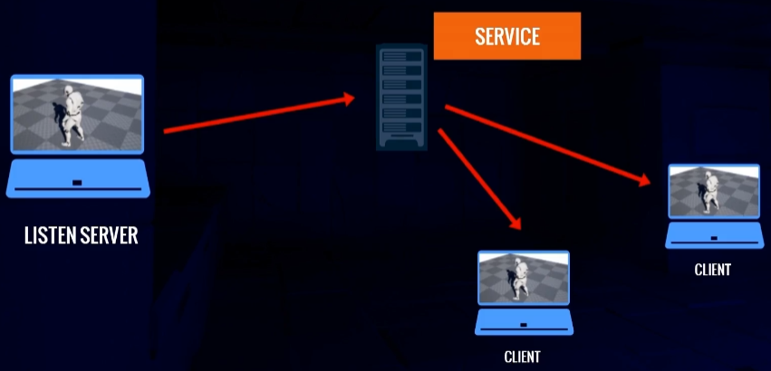

然而，制作我们自己的系统来在我们的服务器上托管游戏，维护玩家安全性和扩展处理大量用户需要额外的专业知识，不仅仅是游戏编程，然后如果你还想要将你的游戏使用Steam或PlayStation等流行的服务，那你还得重写系统使之与他们的代码库兼容，而且不同平台代码库不一样，那你就要处理更多的东西，但是UE给我们提供了一种方便的工具，这就涉及到要讲的Online Subsystem。

## 2、Online Subsystem

> 参考：[在线子系统](https://dev.epicgames.com/documentation/zh-cn/unreal-engine/online-subsystem-in-unreal-engine?application_version=5.3)

回归主题，我们的目标是不需要知道IP地址就可以加入已登录玩家的游戏，为此Unreal Engine给我们提供了一个在线子系统.**在线子系统（Online Subsystem）** 及其接口提供一种可访问Steam、Xbox Live、Facebook等在线服务功能的常用方法。开发一款在多平台上发行或支持多在线服务的游戏时，在线子系统可确保开发者唯一需要做的变更就是对所有支持的服务进行配置调整。例如[Steam平台需要的API及其配置调整](https://dev.epicgames.com/documentation/zh-cn/unreal-engine/online-subsystem-steam-interface-in-unreal-engine?application_version=5.3)。利用此设计，开发人员可为所有在线服务编写相同代码。所以我们只需要使用抽象层，选择哪个服务没那么重要。

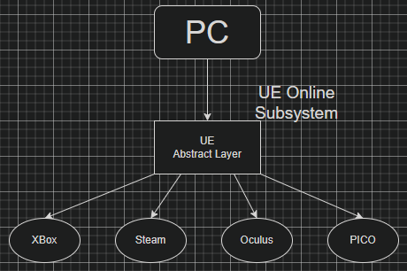

## 3、Session & Matchmaking

匹配(Matchmaking)是将玩家与会话(Session)进行匹配的过程。会话可以被认为是在服务器上运行的游戏实例，且具有给定的一组属性，该实例要么是公开的，以便想要玩游戏的玩家可以找到并加入，要么是私人的，因此只有受到邀请或以某种方式通知的玩家才能加入。

### Session Interface

Session Interface(会话接口)处理创建、管理、销毁、搜索游戏session，和其他匹配功能。会话接口由在线子系统创建并拥有。这意味着它仅存在于服务器上。可以使用下方代码获得：

```c++
IOnlineSubsystem* Subsystem = IOnlineSubsystem::Get(); // 获取在线子系统
if (Subsystem) { // 如果存在，则获取 SessionInterface
    IOnlineSessionPtr SessionInterface = Subsystem->GetSessionInterface();
} 
```

每次只存在一个会话接口 - 即引擎当前运行的平台的会话接口。虽然会话接口执行所有会话处理，但游戏通常不直接与其交互。

相反，AGameSession 充当会话接口的特定游戏包装器，并且游戏代码在需要与会话交互时会调用它。GameSession 由 GameMode 创建并拥有，并且仅在运行在线游戏时存在于服务器上。每个游戏可能有多种 GameSession 类型，但一次只能使用一种。

### 会话属性

SessionSettings 由‘FOnlineSessionSettingsclass’定义，是一组决定会话特征的属性。

在基本实现中，有以下几点：

- 允许玩家数量
- 会话是公开的还是私密的
- 本次比赛是否为局域网比赛
- 服务器是专用的还是由玩家托管的
- 是否允许邀请
- ETC。

使用在线游戏大厅示例，每个游戏都是一个会话，并有自己的会话设置。例如，一些会话可能是玩家对战 (PvP)，而其他则是合作多人游戏 (Co-Op)。

不同的场次可以玩不同的地图或播放列表，需要不同数量的玩家等等。

### 会话生命周期

也可以理解为一个多人的游戏进行流程，官方有提供文档：[会话生命周期](https://dev.epicgames.com/documentation/zh-cn/unreal-engine/sessions-interface-in-unreal-engine#会话生命周期)，获取有些难以理解，那么可以换一个角度去结合理解

- Create Session创建多人房间、大厅
- 等待玩家加入，并在他们进来时给他们注册，如果是可以活动的房间那么他们会加入进来，如果满足一定条件，比如人数足够，进行下一步
- Start Session and Play
- End Session and Unregistered Players结束本场游戏
- Update Session or Destroy Session

我们只需要关注部分就可以创造一个多人游戏了，而关注的主要函数有`CreateSession`、`FindSessions`、`JoinSession`、`DestroySession`。

## 4、简单实现

### 蓝图实现

首先创建一个名为WBP_HUD的UserWidget，然后创建两个按钮：一个是用来创建大厅的Btn_Host，另一个是加入大厅的Btn_Play

然后创建主地图和大厅(Lobby)，之后按照下面创建蓝图：

<iframe src="https://blueprintue.com/render/13j9ho9f/" scrolling="no" allowfullscreen></iframe>

最后将Number of Players设为2或更多，Net Mode设为Play Standalone，点击运行即可测试

### C++实现

使用C++时你会发现功能比官方暴露的功能强大的多。

首先创建一个`UGameInstanceSubsystem`子类命名为`MultiplayerSessionsSubsystem`。UE为我们生成完毕后，添加如下代码：`MultiplayerSessionsSubsystem.h`

```c++
// Fill out your copyright notice in the Description page of Project Settings.

#pragma once

#include "CoreMinimal.h"

#include "Interfaces/OnlineSessionInterface.h"
#include "Subsystems/GameInstanceSubsystem.h"

#include "MultiplayerSessionsSubsystem.generated.h"

// 声明自定义委托，为接下来的Menu类进行回调
//MULTICAST: 多播委托可以绑定多个函数，当委托触发时，将调用所有这些函数。
//DYNAMIC: 动态委托允许在运行时动态地将回调函数与委托关联。它们使用虚函数表（vtable）来实现，可以在运行时改变关联的回调函数。被序列化可在蓝图中保存或加载
// 在蓝图里叫event dispatchers
DECLARE_DYNAMIC_MULTICAST_DELEGATE_OneParam(FMultiplayerOnCreateSessionComplete, bool, bWasSuccessful);
// FOnlineSessionSearchResult 不是 UCLASS or USTRUCT, 所以不能声明为dynamic delegate
DECLARE_MULTICAST_DELEGATE_TwoParams(FMultiplayerOnFindSessionsComplete, const TArray<FOnlineSessionSearchResult>& SessionResult, bool bWasSuccessful);
DECLARE_MULTICAST_DELEGATE_OneParam(FMultiplayerOnJoinSessionComplete, EOnJoinSessionCompleteResult::Type Result);
DECLARE_DYNAMIC_MULTICAST_DELEGATE_OneParam(FMultiplayerOnDestroySessionComplete, bool, bWasSuccessful);

/**
 * 
 */
UCLASS()
class MULTIPLAYERSESSIONS_API UMultiplayerSessionsSubsystem : public UGameInstanceSubsystem
{
	GENERATED_BODY()
public:
	UMultiplayerSessionsSubsystem();

	/**
	 * @brief Create game session. 在Menu中调用
	 * @param NumPublicConnections 指定加入游戏的玩家数
	 * @param MatchType Choose a particular match type
	 */
	void CreateSession(int32 NumPublicConnections, FString MatchType);
	/**
	 * @brief Find game session. 在Menu中调用
	 * @param MaxSearch 指定search results的数量
	 */
	void FindSessions(int32 MaxSearch);
	void JoinSession(const FOnlineSessionSearchResult& SessionSearchResult);
	void DestroySession();

	bool IsValidSessionInterface();
	
	// 自定义委托来让Menu绑定，使之可以回调给Menu
	FMultiplayerOnCreateSessionComplete MultiplayerOnCreateSessionComplete;
	FMultiplayerOnFindSessionsComplete MultiplayerOnFindSessionsComplete;
	FMultiplayerOnJoinSessionComplete MultiplayerOnJoinSessionComplete;
	FMultiplayerOnDestroySessionComplete MultiplayerOnDestroySessionComplete;

protected:
	//Online Session Interface Callback Funcions
	void OnCreateSessionComplete(FName SessionName, bool bWasSuccessful);
	void OnFindSessionsComplete(bool bWasSuccessful);
	void OnJoinSessionComplete(FName SessionName, EOnJoinSessionCompleteResult::Type Result);
	void OnDestroySessionComplete(FName SessionName, bool bWasSuccessful);

private:
	IOnlineSessionPtr SessionInterface;
	//用来create session
	TSharedPtr<FOnlineSessionSettings> LastSessionSettings;
	TSharedPtr<FOnlineSessionSearch> LastSessionSearch;

	//添加到 Online Session Interface 委托列表中.
	//同时会与MultiplayerSessionsSubsystem绑定来回调这些
	FOnCreateSessionCompleteDelegate CreateSessionCompleteDelegate;
	FDelegateHandle CreateSessionCompleteDelegateHandle;
	FOnFindSessionsCompleteDelegate FindSessionsCompleteDelegate;
	FDelegateHandle FindSessionsCompleteDelegateHandle;
	FOnJoinSessionCompleteDelegate JoinSessionCompleteDelegate;
	FDelegateHandle JoinSessionCompleteDelegateHandle;
	FOnDestroySessionCompleteDelegate DestroySessionCompleteDelegate;
	FDelegateHandle DestroySessionCompleteDelegateHandle;

	bool bCreateSessionOnDestroy{ false };
	int32 LastNumPublicConnections;
	FString LastMatchType;
};
```

`MultiplayerSessionsSubsystem.cpp`

```c++
// Fill out your copyright notice in the Description page of Project Settings.

#include "MultiplayerSessionsSubsystem.h"
#include "OnlineSubsystem.h"
#include "OnlineSessionSettings.h"
//#include "Online/OnlineSessionNames.h"

UMultiplayerSessionsSubsystem::UMultiplayerSessionsSubsystem():
	CreateSessionCompleteDelegate(FOnCreateSessionCompleteDelegate::CreateUObject(this, &ThisClass::OnCreateSessionComplete)),
	FindSessionsCompleteDelegate(FOnFindSessionsCompleteDelegate::CreateUObject(this, &ThisClass::OnFindSessionsComplete)),
	JoinSessionCompleteDelegate(FOnJoinSessionCompleteDelegate::CreateUObject(this, &ThisClass::OnJoinSessionComplete)),
	DestroySessionCompleteDelegate(FOnDestroySessionCompleteDelegate::CreateUObject(this, &ThisClass::OnDestroySessionComplete))
{
}

void UMultiplayerSessionsSubsystem::CreateSession(int32 NumPublicConnections, FString MatchType)
{
	if (!IsValidSessionInterface())
	{
		return;
	}

	auto ExistingSession = SessionInterface->GetNamedSession(NAME_GameSession);
	if (ExistingSession != nullptr)
	{
		bCreateSessionOnDestroy = true;
		LastNumPublicConnections = NumPublicConnections;
		LastMatchType = MatchType;

		DestroySession();
	}
	
	// 将委托存在FDelegateHandle便于以后从delegate list移除
	CreateSessionCompleteDelegateHandle = SessionInterface->AddOnCreateSessionCompleteDelegate_Handle(CreateSessionCompleteDelegate);

	LastSessionSettings = MakeShareable(new FOnlineSessionSettings());
	LastSessionSettings->bIsLANMatch = IOnlineSubsystem::Get()->GetSubsystemName() == "NULL" ? true : false;
	LastSessionSettings->NumPublicConnections = NumPublicConnections;
	LastSessionSettings->bAllowJoinInProgress = true;
	LastSessionSettings->bAllowJoinViaPresence = true;
	LastSessionSettings->bShouldAdvertise = true;
	LastSessionSettings->bUsesPresence = true;
	//SessionSettings->bUseLobbiesIfAvailable = true;
	//有很多match types, 但是我们可以指定键和值以仅加入具有我们正在搜索的匹配类型的会话
	LastSessionSettings->Set(FName("MatchType"), MatchType, EOnlineDataAdvertisementType::ViaOnlineServiceAndPing);
	LastSessionSettings->BuildUniqueId = 1;

	const ULocalPlayer* LocalPlayer = GetWorld()->GetFirstLocalPlayerFromController();
	if (!SessionInterface->CreateSession(*LocalPlayer->GetPreferredUniqueNetId(), NAME_GameSession, *LastSessionSettings))
	{
		SessionInterface->ClearOnCreateSessionCompleteDelegate_Handle(CreateSessionCompleteDelegateHandle);

		MultiplayerOnCreateSessionComplete.Broadcast(false);
	}
}

void UMultiplayerSessionsSubsystem::FindSessions(int32 MaxSearch)
{
	if (!IsValidSessionInterface())
	{
		return;
	}

	FindSessionsCompleteDelegateHandle = SessionInterface->AddOnFindSessionsCompleteDelegate_Handle(FindSessionsCompleteDelegate);

	LastSessionSearch = MakeShareable(new FOnlineSessionSearch());
	LastSessionSearch->MaxSearchResults = MaxSearch;
	LastSessionSearch->bIsLanQuery = IOnlineSubsystem::Get()->GetSubsystemName() == "NULL" ? true : false;
	LastSessionSearch->QuerySettings.Set(SEARCH_PRESENCE, true, EOnlineComparisonOp::Equals);

	const ULocalPlayer* LocalPlayer = GetWorld()->GetFirstLocalPlayerFromController();
	if (!SessionInterface->FindSessions(*LocalPlayer->GetPreferredUniqueNetId(), LastSessionSearch.ToSharedRef()))
	{
		SessionInterface->ClearOnFindSessionsCompleteDelegate_Handle(FindSessionsCompleteDelegateHandle);

		MultiplayerOnFindSessionsComplete.Broadcast(TArray<FOnlineSessionSearchResult>(), false);
	}
	
}

void UMultiplayerSessionsSubsystem::JoinSession(const FOnlineSessionSearchResult& SessionSearchResult)
{
	if (!SessionInterface.IsValid())
	{
		MultiplayerOnJoinSessionComplete.Broadcast(EOnJoinSessionCompleteResult::UnknownError);
		return;
	}

	JoinSessionCompleteDelegateHandle = SessionInterface->AddOnJoinSessionCompleteDelegate_Handle(JoinSessionCompleteDelegate);

	const ULocalPlayer* LocalPlayer = GetWorld()->GetFirstLocalPlayerFromController();
	if (!SessionInterface->JoinSession(*LocalPlayer->GetPreferredUniqueNetId(), NAME_GameSession, SessionSearchResult))
	{
		SessionInterface->ClearOnJoinSessionCompleteDelegate_Handle(JoinSessionCompleteDelegateHandle);

		MultiplayerOnJoinSessionComplete.Broadcast(EOnJoinSessionCompleteResult::UnknownError);
	}
}

void UMultiplayerSessionsSubsystem::DestroySession()
{
	if (!SessionInterface.IsValid())
	{
		MultiplayerOnDestroySessionComplete.Broadcast(false);
		return;
	}

	DestroySessionCompleteDelegateHandle = SessionInterface->AddOnDestroySessionCompleteDelegate_Handle(DestroySessionCompleteDelegate);

	if (!SessionInterface->DestroySession(NAME_GameSession))
	{
		SessionInterface->ClearOnDestroySessionCompleteDelegate_Handle(DestroySessionCompleteDelegateHandle);
		MultiplayerOnDestroySessionComplete.Broadcast(false);
	}
}

bool UMultiplayerSessionsSubsystem::IsValidSessionInterface()
{
	if (!SessionInterface)
	{
		IOnlineSubsystem* Subsystem = IOnlineSubsystem::Get();
		if (Subsystem)
		{
			SessionInterface = Subsystem->GetSessionInterface();
		}
	}
	return SessionInterface.IsValid();
}

void UMultiplayerSessionsSubsystem::OnCreateSessionComplete(FName SessionName, bool bWasSuccessful)
{
	if (SessionInterface)
	{
		SessionInterface->ClearOnCreateSessionCompleteDelegate_Handle(CreateSessionCompleteDelegateHandle);
	}

	MultiplayerOnCreateSessionComplete.Broadcast(bWasSuccessful);
}

void UMultiplayerSessionsSubsystem::OnFindSessionsComplete(bool bWasSuccessful)
{
	if (SessionInterface)
	{
		SessionInterface->ClearOnFindSessionsCompleteDelegate_Handle(FindSessionsCompleteDelegateHandle);
	}

	if (LastSessionSearch->SearchResults.Num() <= 0)
	{
		MultiplayerOnFindSessionsComplete.Broadcast(TArray<FOnlineSessionSearchResult>(), false);
		return;
	}

	MultiplayerOnFindSessionsComplete.Broadcast(LastSessionSearch->SearchResults, bWasSuccessful);
}

void UMultiplayerSessionsSubsystem::OnJoinSessionComplete(FName SessionName, EOnJoinSessionCompleteResult::Type Result)
{
	if (SessionInterface)
	{
		SessionInterface->ClearOnJoinSessionCompleteDelegate_Handle(JoinSessionCompleteDelegateHandle);
	}

	MultiplayerOnJoinSessionComplete.Broadcast(Result);
}

void UMultiplayerSessionsSubsystem::OnDestroySessionComplete(FName SessionName, bool bWasSuccessful)
{
	if (SessionInterface)
	{
		SessionInterface->ClearOnDestroySessionCompleteDelegate_Handle(DestroySessionCompleteDelegateHandle);
	}
	if (bWasSuccessful && bCreateSessionOnDestroy)
	{
		bCreateSessionOnDestroy = false;
		CreateSession(LastNumPublicConnections, LastMatchType);
	}
	MultiplayerOnDestroySessionComplete.Broadcast(bWasSuccessful);
}
```

在这个`cpp`中就可以看到CreateSession和FindSession有很多蓝图没有的配置步骤。

接下来我们就需要在UI里写一些东西来调用这些功能函数，当然，你也可以像之前一样写在人物中通过按键绑定来执行。

`Menu.h`

```c++
// Fill out your copyright notice in the Description page of Project Settings.

#pragma once

#include "CoreMinimal.h"
#include "Blueprint/UserWidget.h"
#include "Interfaces/OnlineSessionInterface.h"
#include "Menu.generated.h"

UCLASS()
class MULTIPLAYERSESSIONS_API UMenu : public UUserWidget
{
	GENERATED_BODY()
public:
	UFUNCTION(BlueprintCallable)
	void MenuSetup(int32 NumOfPublicConnections = 4, FString TypeOfMatch = FString(TEXT("FreeForAll")), FString LobbyPath = FString(TEXT("/Game/ThirdPersonCPP/Maps/Lobby")));

protected:

	virtual bool Initialize() override;
	virtual void NativeDestruct() override;

	// 会被MultiplayerSessionsSubsystem回调
    //进行了动态绑定的函数必须加UFUNCTION()宏标记
	UFUNCTION()
	void OnCreateSession(bool bWasSuccessful);
	void OnFindSessions(const TArray<FOnlineSessionSearchResult>& SessionResults, bool bWasSuccessful);
	void OnJoinSession(EOnJoinSessionCompleteResult::Type Result);
	UFUNCTION()
	void OnDestroySession(bool bWasSuccessful);
private:
	//BindWidget: 在蓝图中的button widget会被连接到C++中的button变量
	//而且必须命名完全相同
	UPROPERTY(meta = (BindWidget))
	class UButton* HostButton;
	
	UPROPERTY(meta = (BindWidget))
	UButton* JoinButton;

	//绑定这个函数到，在UButton class中的点击事件
	UFUNCTION()
	void HostButtonClicked();

	UFUNCTION()
	void JoinButtonClicked();

	void MenuTearDown();

	class UMultiplayerSessionsSubsystem* MultiplayerSessionsSubsystem;

	int32 NumPublicConnections{4};
	FString MatchType{TEXT("FreeForAll")};
	FString PathToLobby{TEXT("")};
};
```

`Menu.cpp`

```c++
// Fill out your copyright notice in the Description page of Project Settings.

#include "Menu.h"
#include "Components/Button.h"

#include "MultiplayerSessionsSubsystem.h"
#include "OnlineSessionSettings.h"
#include "OnlineSubsystem.h"

//需要手动调用
void UMenu::MenuSetup(int32 NumOfPublicConnections, FString TypeOfMatch, FString LobbyPath)
{
	PathToLobby = FString::Printf(TEXT("%s?listen"), *LobbyPath);
	NumPublicConnections = NumOfPublicConnections;
	MatchType = TypeOfMatch;
	AddToViewport();
	SetVisibility(ESlateVisibility::Visible);
	//bIsFocusable = true;
	SetIsFocusable(true);

	UWorld* World = GetWorld();
	if (World)
	{
		APlayerController* PlayerController = World->GetFirstPlayerController();
		if (PlayerController)
		{
			FInputModeUIOnly InputModeData;
			InputModeData.SetWidgetToFocus(TakeWidget());
			InputModeData.SetLockMouseToViewportBehavior(EMouseLockMode::DoNotLock);
			PlayerController->SetInputMode(InputModeData);
			PlayerController->SetShowMouseCursor(true);
		}
	}

	UGameInstance* GameInstance = GetGameInstance();
	if (GameInstance)
	{
		MultiplayerSessionsSubsystem = GameInstance->GetSubsystem<UMultiplayerSessionsSubsystem>();
	}

	if (MultiplayerSessionsSubsystem)
	{
		MultiplayerSessionsSubsystem->MultiplayerOnCreateSessionComplete.AddDynamic(this, &UMenu::OnCreateSession);
		MultiplayerSessionsSubsystem->MultiplayerOnFindSessionsComplete.AddUObject(this, &UMenu::OnFindSessions);
		MultiplayerSessionsSubsystem->MultiplayerOnJoinSessionComplete.AddUObject(this, &UMenu::OnJoinSession);
		MultiplayerSessionsSubsystem->MultiplayerOnDestroySessionComplete.AddDynamic(this, &UMenu::OnDestroySession);
	}
}

bool UMenu::Initialize()
{
	if (!Super::Initialize())
	{
		return false;
	}
	if (HostButton)
	{
		HostButton->OnClicked.AddDynamic(this, &UMenu::HostButtonClicked);
	}
	if (JoinButton)
	{
		JoinButton->OnClicked.AddDynamic(this, &UMenu::JoinButtonClicked);
	}
	return true;
}

//退出或转移关卡时会调用，因为可能保存大量引用而关卡和Actor等都会被销毁，会有危险，因此最好销毁UI，如果对这个函数改写为不销毁，那么UI即永久
void UMenu::NativeDestruct()
{
	MenuTearDown();
	Super::NativeDestruct();
}

void UMenu::OnCreateSession(bool bWasSuccessful)
{
	if (bWasSuccessful)
	{
		UWorld* World = GetWorld();
		if (World)
		{
			World->ServerTravel(PathToLobby);
		}
	}
	else
	{
		if (GEngine) {
			GEngine->AddOnScreenDebugMessage(
				-1, 15.f, FColor::Red,
				FString::Printf(TEXT("failed to create session"))
			);
		}
		HostButton->SetIsEnabled(true);
	}
}

void UMenu::OnFindSessions(const TArray<FOnlineSessionSearchResult>& SessionResults, bool bWasSuccessful)
{
	if (MultiplayerSessionsSubsystem == nullptr)
	{
		return;
	}

	for (auto Result : SessionResults)
	{
		FString SettingsValue;
		Result.Session.SessionSettings.Get(FName("MatchType"), SettingsValue);
		if (SettingsValue == MatchType)
		{
			MultiplayerSessionsSubsystem->JoinSession(Result);
			return;
		}
	}
	if (!bWasSuccessful || SessionResults.Num() == 0)
	{
		JoinButton->SetIsEnabled(true);
	}
}

void UMenu::OnJoinSession(EOnJoinSessionCompleteResult::Type Result)
{
	IOnlineSubsystem* Subsystem = IOnlineSubsystem::Get();
	if (Subsystem)
	{
		IOnlineSessionPtr SessionInterface = Subsystem->GetSessionInterface();
		if (SessionInterface.IsValid())
		{
			FString Address;
			SessionInterface->GetResolvedConnectString(NAME_GameSession, Address);

			APlayerController* PlayerController = GetGameInstance()->GetFirstLocalPlayerController();
			if (PlayerController)
			{
				PlayerController->ClientTravel(Address, ETravelType::TRAVEL_Absolute);
			}
		}
	}
	// 将会发生这样的情况：离开了服务器，但忘记清理会话，并且尝试创建或加入新会话将不再有效，除非重新启动游戏/编辑器。
	//因此，在调用 DestroySession 之前，会话仍然存在，但我们无法加入它，因为没有有效的地址可供访问
    //所以当服务器和客户端离开时，必须销毁会话。或者应该考虑在创建或加入之前销毁会话（如果已经存在）。
	if (Result != EOnJoinSessionCompleteResult::Success)
	{
		JoinButton->SetIsEnabled(true);
	}
}

void UMenu::OnDestroySession(bool bWasSuccessful)
{
}

void UMenu::HostButtonClicked()
{
	HostButton->SetIsEnabled(false);
	if (MultiplayerSessionsSubsystem)
	{
		MultiplayerSessionsSubsystem->CreateSession(NumPublicConnections, MatchType);
	}
}

void UMenu::JoinButtonClicked()
{
	JoinButton->SetIsEnabled(false);
	if (MultiplayerSessionsSubsystem)
	{
		MultiplayerSessionsSubsystem->FindSessions(10000);
	}
}

void UMenu::MenuTearDown()
{
	RemoveFromParent();
	UWorld* World = GetWorld();
	if (World)
	{
		APlayerController* PlayerController = World->GetFirstPlayerController();
		if (PlayerController)
		{
			FInputModeGameOnly InputModeGameOnly;
			PlayerController->SetInputMode(InputModeGameOnly);
			PlayerController->SetShowMouseCursor(false);
		}
	}
}
```

在蓝图中添加和Menu相同名字的按钮：`HostButton`, `JoinButton`，然后`AddToViewport`(记得调用`MenuSetup`)接下来就可以使用了。

> 提供源工程：[Muti_MenuSystem](https://github.com/windcrazy123/Multi_MenuSystem)
>
> 参考：[Unreal Engine Multiplayer Sessions in C++](https://cedric-neukirchen.net/docs/session-management/sessions-in-cpp)


# 额外致谢

除文章提到的，还要另外感谢他们提供的帮助

- [@DruidMechanics](https://twitter.com/DruidMechanics)
